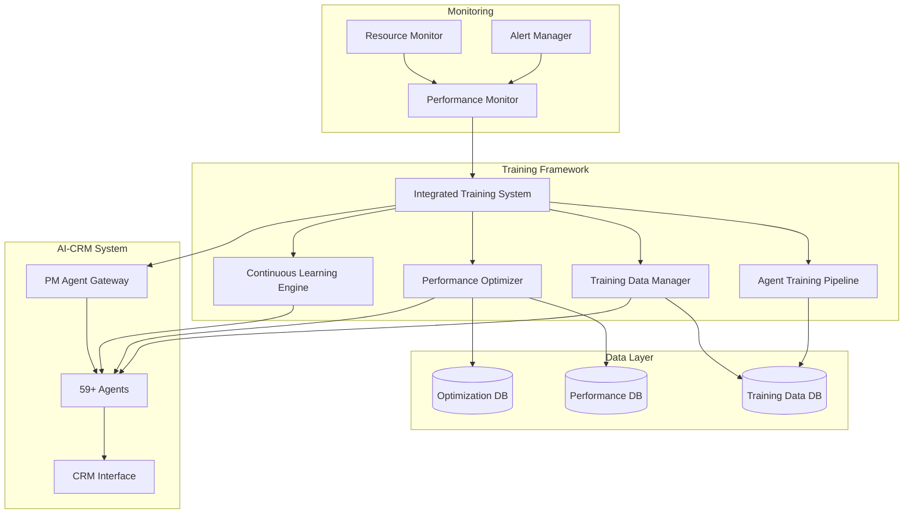
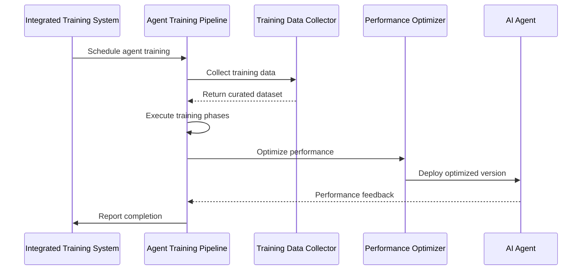

# AI-CRM Agent Training Framework

## Comprehensive Documentation for the 59+ Agent Training System

### Table of Contents
1. [Overview](#overview)
2. [Architecture](#architecture)
3. [Core Components](#core-components)
4. [Training Pipeline](#training-pipeline)
5. [Performance Optimization](#performance-optimization)
6. [Data Management](#data-management)
7. [Continuous Learning](#continuous-learning)
8. [System Integration](#system-integration)
9. [Deployment Guide](#deployment-guide)
10. [API Reference](#api-reference)
11. [Best Practices](#best-practices)
12. [Troubleshooting](#troubleshooting)

---

## Overview

The AI-CRM Agent Training Framework is a comprehensive, production-ready system designed to train, optimize, and continuously improve 59+ specialized AI agents within the AI-CRM ecosystem. This framework provides automated training pipelines, performance monitoring, data curation, and intelligent optimization strategies.

### Key Features

- **Scalable Training Pipeline**: Handles training for all 59+ specialized agents simultaneously
- **Performance Optimization**: Real-time monitoring and optimization with A/B testing
- **Continuous Learning**: Automated feedback collection and model improvement
- **Data Management**: Advanced data curation, validation, and privacy compliance
- **Production Ready**: Enterprise-grade monitoring, alerting, and deployment capabilities
- **Integration**: Seamless integration with existing PM Agent Gateway and CRM systems

### Supported Agents

The framework supports all 59+ specialized agents including:

**Programming Languages**: python-pro, javascript-pro, typescript-pro, golang-pro, rust-pro, java-pro, csharp-pro, cpp-pro, php-pro, scala-pro, elixir-pro, sql-pro

**Frontend & Mobile**: frontend-developer, ui-ux-designer, mobile-developer, ios-developer, unity-developer

**Architecture & Backend**: backend-architect, architect-reviewer, graphql-architect

**Infrastructure**: cloud-architect, devops-troubleshooter, deployment-engineer, terraform-specialist, network-engineer, incident-responder

**Data & AI**: database-optimizer, data-scientist, data-engineer, ai-engineer, ml-engineer, mlops-engineer, prompt-engineer

**Quality & Security**: security-auditor, code-reviewer, test-automator, debugger, error-detective, performance-engineer

**Documentation**: docs-architect, api-documenter, reference-builder, tutorial-engineer, content-marketer

**Business**: business-analyst, sales-automator, customer-support, legal-advisor

**Specialized**: payment-integration, legacy-modernizer, context-manager, and more

---

## Architecture

### High-Level Architecture



### Component Architecture

The framework follows a modular, microservices-inspired architecture:

1. **Orchestration Layer**: Integrated Training System coordinates all operations
2. **Training Layer**: Core training pipeline and data management
3. **Optimization Layer**: Performance monitoring and optimization
4. **Data Layer**: Persistent storage for training data and metrics
5. **Integration Layer**: Interfaces with existing AI-CRM components

---

## Core Components

### 1. Agent Training Framework (`agent_training_framework.py`)

**Purpose**: Core training pipeline orchestration and management

**Key Classes**:
- `AgentTrainingPipeline`: Main orchestrator for training workflows
- `TrainingDataCollector`: Collects training data from real usage
- `PerformanceEvaluator`: Tracks and analyzes agent performance
- `ContinuousLearningEngine`: Manages feedback loops and improvements

**Features**:
- Multi-phase training (Initial, Fine-tuning, Specialization, Continuous)
- Performance metric tracking (Accuracy, Response Time, User Satisfaction)
- Automated training scheduling and resource management
- Integration with existing PM Agent Gateway

### 2. Training Data Manager (`training_data_manager.py`)

**Purpose**: Advanced data collection, curation, and quality management

**Key Classes**:
- `TrainingDataCurator`: Manages data quality and validation
- `DataValidationRule`: Configurable validation rules for data quality
- `TrainingDataset`: Version-controlled datasets with metadata

**Features**:
- Automated data collection from CRM interactions
- Data quality scoring and validation
- Privacy-compliant data handling with encryption
- Data augmentation for improved training coverage
- Export capabilities for external analysis

### 3. Performance Optimizer (`performance_optimizer.py`)

**Purpose**: Real-time performance monitoring and optimization

**Key Classes**:
- `AgentOptimizer`: Core optimization engine
- `PerformanceMonitor`: Real-time monitoring and alerting
- `ABTestExperiment`: A/B testing framework for optimizations
- `PerformanceBenchmark`: Benchmarking and comparison tools

**Features**:
- Multiple optimization strategies (Response Time, Accuracy, Resource Efficiency)
- Real-time performance alerting
- A/B testing for optimization validation
- Automated optimization technique application
- Resource usage monitoring and optimization

### 4. Integrated Training System (`integrated_training_system.py`)

**Purpose**: Unified orchestration of all training components

**Key Classes**:
- `IntegratedTrainingSystem`: Master orchestrator
- `SystemTrainingConfig`: Configuration management
- `AgentTrainingStatus`: Per-agent status tracking

**Features**:
- Automated scheduling and priority management
- Emergency training triggers
- System-wide health monitoring
- Dashboard and reporting capabilities
- Production deployment management

---

## Training Pipeline

### Training Phases

The training pipeline consists of four distinct phases:

#### 1. Initial Training
- **Purpose**: Establish baseline capabilities for new agents
- **Duration**: 2-4 hours
- **Data Requirements**: Minimum 100 high-quality training examples
- **Success Criteria**: Accuracy > 60%, Response time < 3s

#### 2. Fine-Tuning
- **Purpose**: Improve performance on specific tasks
- **Duration**: 1-2 hours
- **Data Requirements**: Domain-specific examples with feedback
- **Success Criteria**: 10-20% improvement in target metrics

#### 3. Specialization
- **Purpose**: Develop deep expertise in specific domains
- **Duration**: 3-6 hours
- **Data Requirements**: Expert-validated examples and edge cases
- **Success Criteria**: Domain expertise score > 80%

#### 4. Continuous Learning
- **Purpose**: Ongoing improvement from real usage
- **Duration**: Ongoing (background process)
- **Data Requirements**: Real-time feedback and usage data
- **Success Criteria**: Maintain or improve performance over time

### Training Workflow



### Data Collection Strategy

Training data is collected from multiple sources:

1. **User Interactions**: Real CRM task interactions and outcomes
2. **Task Completion**: Success/failure rates and user feedback
3. **PM Gateway Decisions**: Decision accuracy and user acceptance
4. **Agent Collaboration**: Multi-agent task coordination data
5. **Error Correction**: Failed tasks and successful corrections
6. **Expert Annotation**: Human expert validation and improvements
7. **Synthetic Generation**: AI-generated training scenarios

---

## Performance Optimization

### Optimization Strategies

The framework supports multiple optimization strategies:

#### 1. Response Time Optimization
- **Techniques**: Caching, Context Pruning, Prompt Optimization
- **Target**: Reduce response time by 30-50%
- **Monitoring**: Real-time latency tracking

#### 2. Accuracy Optimization
- **Techniques**: Prompt Engineering, Context Enhancement
- **Target**: Improve accuracy by 10-20%
- **Monitoring**: Task success rate tracking

#### 3. Resource Efficiency
- **Techniques**: Memory Optimization, Batching, Load Balancing
- **Target**: Reduce resource usage by 20-40%
- **Monitoring**: CPU and memory usage tracking

#### 4. Throughput Optimization
- **Techniques**: Parallel Processing, Batching
- **Target**: Increase throughput by 40-60%
- **Monitoring**: Tasks per minute tracking

### A/B Testing Framework

The system includes a comprehensive A/B testing framework:

```python
# Example A/B test setup
experiment_id = optimizer.start_ab_test(
    agent_name="python-pro",
    test_name="prompt_optimization_v2",
    control_version="v1.0",
    treatment_version="v1.1",
    sample_size=100,
    confidence_level=0.95
)

# Add test data
optimizer.add_ab_test_data(experiment_id, "v1.0", {
    "accuracy": 0.85,
    "response_time": 2.1
})

# System automatically analyzes results when sample size is reached
```

### Performance Monitoring

Real-time monitoring includes:

- **System Metrics**: CPU, memory, disk usage
- **Agent Metrics**: Response time, accuracy, user satisfaction
- **Business Metrics**: Task completion rate, user engagement
- **Alert Thresholds**: Configurable alerting for performance degradation

---

## Data Management

### Data Quality Framework

The training data manager implements a comprehensive quality framework:

#### Quality Scoring
```python
def calculate_data_quality_score(data_point):
    score = 0.0
    
    # Input quality (20 points)
    if len(input_text) >= 50: score += 20
    
    # Output quality (25 points)
    if meaningful_output(expected_output): score += 25
    
    # Context richness (15 points)
    score += min(len(context_keys) * 3, 15)
    
    # Domain relevance (20 points)
    if domain_relevant(agent_name, input_text): score += 20
    
    # Validation status (10 points)
    if validation_passed: score += 10
    
    # Performance score bonus (10 points)
    score += performance_score * 10
    
    return min(score / 100, 1.0)
```

#### Validation Rules

1. **Data Completeness**: Minimum required fields populated
2. **Privacy Compliance**: No sensitive information detection
3. **Domain Relevance**: Content matches agent specialization
4. **Quality Thresholds**: Minimum quality scores enforced
5. **Duplication Detection**: Content hash-based deduplication

### Data Augmentation

Automated data augmentation strategies:

- **Code Variation**: Generate alternative implementations
- **Error Injection**: Create debugging scenarios
- **Context Expansion**: Add related information
- **Scenario Generation**: Create edge cases and variations

### Privacy and Security

- **Data Encryption**: Sensitive fields encrypted at rest
- **Access Control**: Role-based access to training data
- **Audit Logging**: Complete audit trail of data access
- **GDPR Compliance**: Right to deletion and data portability
- **Anonymization**: PII removal and replacement

---

## Continuous Learning

### Feedback Collection

The system collects feedback from multiple sources:

1. **User Ratings**: Direct user feedback on agent responses
2. **Task Success**: Automated success/failure detection
3. **Peer Review**: Agent-to-agent quality assessment
4. **Performance Metrics**: Automated metric collection
5. **Error Analysis**: Failed task post-mortems

### Learning Triggers

Continuous learning is triggered by:

- **Performance Degradation**: Metrics below thresholds
- **User Complaints**: Negative feedback patterns
- **New Data Availability**: Fresh training examples
- **Scheduled Updates**: Regular improvement cycles
- **Emergency Situations**: Critical performance issues

### Adaptation Strategies

1. **Incremental Learning**: Small, frequent updates
2. **Full Retraining**: Complete model refresh when needed
3. **Transfer Learning**: Knowledge sharing between related agents
4. **Ensemble Methods**: Combining multiple approaches
5. **Rollback Capabilities**: Quick reversion to previous versions

---

## System Integration

### PM Agent Gateway Integration

The training framework integrates seamlessly with the existing PM Agent Gateway:

```python
# Example integration
pm_gateway = PMAgentGateway()
task_analysis = pm_gateway.create_managed_task(title, description)

# Collect training data from PM decisions
training_collector.collect_pm_gateway_decisions(
    task_title=title,
    task_description=description,
    pm_recommendation=task_analysis,
    user_accepted=user_accepted_suggestion
)
```

### CRM System Integration

Direct integration with YouGile CRM system:

- **Task Monitoring**: Real-time task performance tracking
- **User Feedback**: Automated feedback collection from task comments
- **Success Metrics**: Task completion and user satisfaction tracking
- **Agent Assignment**: Intelligent agent selection and routing

### External System Integration

The framework provides APIs for:

- **Metrics Export**: Prometheus/Grafana integration
- **Alert Management**: PagerDuty/Slack notifications
- **Data Export**: Integration with external ML platforms
- **Audit Systems**: Compliance and audit trail export

---

## Deployment Guide

### Prerequisites

- Python 3.8+
- SQLite 3.35+ (or PostgreSQL for production)
- 4GB+ RAM (8GB+ recommended for production)
- 2+ CPU cores (4+ recommended for production)

### Installation

1. **Clone Repository**:
```bash
git clone <repository-url>
cd agents-list/our-crm-ai
```

2. **Install Dependencies**:
```bash
pip install -r requirements.txt
```

3. **Setup Database**:
```bash
python agent_training_framework.py --setup-db
python training_data_manager.py --setup-db
python performance_optimizer.py --setup-db
```

4. **Configuration**:
```bash
cp integrated_training_config.json.example integrated_training_config.json
# Edit configuration as needed
```

### Production Deployment

#### Docker Deployment

```dockerfile
FROM python:3.9-slim

WORKDIR /app
COPY requirements.txt .
RUN pip install -r requirements.txt

COPY . .
EXPOSE 8000

CMD ["python", "integrated_training_system.py", "start"]
```

#### Docker Compose

```yaml
version: '3.8'
services:
  training-system:
    build: .
    ports:
      - "8000:8000"
    environment:
      - DB_HOST=postgres
      - REDIS_URL=redis://redis:6379
    depends_on:
      - postgres
      - redis
    
  postgres:
    image: postgres:13
    environment:
      POSTGRES_DB: training_data
      POSTGRES_USER: training_user
      POSTGRES_PASSWORD: secure_password
    volumes:
      - postgres_data:/var/lib/postgresql/data
      
  redis:
    image: redis:6-alpine
    
volumes:
  postgres_data:
```

### Configuration Options

#### System Configuration (`integrated_training_config.json`)

```json
{
  "training_schedule": {
    "pm-agent-gateway": "0 2 * * *",
    "security-auditor": "0 4 */2 * *",
    "*": "0 0 * * 0"
  },
  "batch_size": 3,
  "max_concurrent_training": 2,
  "auto_optimization": true,
  "performance_monitoring": true,
  "continuous_learning": true,
  "resource_limits": {
    "max_memory_gb": 4,
    "max_cpu_percent": 80,
    "max_training_duration_hours": 2
  },
  "notification_settings": {
    "training_completion": true,
    "performance_alerts": true,
    "system_errors": true
  }
}
```

### Monitoring Setup

#### Prometheus Metrics

The system exposes metrics on `/metrics` endpoint:

- `training_sessions_total`: Total training sessions
- `agent_performance_score`: Current agent performance scores
- `training_queue_length`: Current training queue length
- `system_resource_usage`: System resource utilization

#### Grafana Dashboard

Import the provided Grafana dashboard (`grafana-dashboard.json`) for visualization.

#### Alerting Rules

Example Prometheus alerting rules:

```yaml
groups:
  - name: training_system
    rules:
      - alert: AgentPerformanceLow
        expr: agent_performance_score < 0.6
        for: 5m
        labels:
          severity: warning
        annotations:
          summary: "Agent {{ $labels.agent }} has low performance"
          
      - alert: TrainingSystemDown
        expr: up{job="training_system"} == 0
        for: 1m
        labels:
          severity: critical
        annotations:
          summary: "Training system is down"
```

---

## API Reference

### Training System API

#### Start System Training
```python
system = IntegratedTrainingSystem()
await system.start_system_training()
```

#### Get System Dashboard
```python
dashboard = system.get_system_dashboard()
# Returns comprehensive system status and metrics
```

#### Emergency Retrain Agent
```python
success = system.emergency_retrain_agent(
    agent_name="python-pro",
    reason="Performance degradation detected"
)
```

### Training Pipeline API

#### Train Specific Agent
```python
pipeline = AgentTrainingPipeline()
results = pipeline.run_comprehensive_training("javascript-pro")
```

#### Start Training Session
```python
session_id = pipeline.start_training_session(
    agent_name="security-auditor",
    phase=TrainingPhase.FINE_TUNING
)
```

### Data Manager API

#### Create Dataset
```python
curator = TrainingDataCurator()
dataset_id = curator.create_training_dataset(
    name="Python Expert Dataset v2.0",
    agent_name="python-pro",
    data_sources=[DataSource.USER_INTERACTION, DataSource.EXPERT_ANNOTATION]
)
```

#### Add Training Data
```python
data_points = [
    {
        "agent_name": "python-pro",
        "input_text": "How to optimize this Python code?",
        "expected_output": "Use list comprehension and built-in functions",
        "performance_score": 0.85
    }
]
results = curator.add_data_to_dataset(dataset_id, data_points)
```

### Performance Optimizer API

#### Optimize Agent
```python
optimizer = AgentOptimizer()
results = optimizer.optimize_agent(
    agent_name="frontend-developer",
    strategy=OptimizationStrategy.RESPONSE_TIME,
    current_metrics={"response_time": 3.2, "accuracy": 0.78}
)
```

#### Start A/B Test
```python
experiment_id = optimizer.start_ab_test(
    agent_name="database-optimizer",
    test_name="query_optimization_v3",
    control_version="v2.1",
    treatment_version="v3.0"
)
```

---

## Best Practices

### Training Best Practices

1. **Data Quality First**: Always prioritize data quality over quantity
2. **Incremental Training**: Use incremental updates for production agents
3. **Validation**: Always validate training results before deployment
4. **Monitoring**: Continuously monitor agent performance post-deployment
5. **Rollback Plan**: Maintain ability to rollback to previous versions

### Performance Optimization

1. **Baseline First**: Establish performance baselines before optimization
2. **A/B Testing**: Always validate optimizations with controlled experiments
3. **Resource Monitoring**: Monitor resource usage during optimization
4. **Gradual Deployment**: Deploy optimizations gradually to detect issues
5. **Documentation**: Document all optimization changes and results

### Data Management

1. **Privacy Compliance**: Ensure all data handling meets privacy requirements
2. **Version Control**: Maintain version control for all training datasets
3. **Quality Metrics**: Regularly audit data quality and address issues
4. **Backup Strategy**: Implement comprehensive backup and recovery procedures
5. **Access Control**: Implement strict access controls for training data

### System Operation

1. **Monitoring**: Implement comprehensive monitoring and alerting
2. **Capacity Planning**: Plan for resource requirements as system scales
3. **Documentation**: Maintain up-to-date documentation and runbooks
4. **Testing**: Regularly test all system components and procedures
5. **Security**: Implement security best practices for all components

---

## Troubleshooting

### Common Issues

#### Training Failures

**Problem**: Training session fails to start
**Symptoms**: Error messages in logs, agent stuck in queue
**Solutions**:
1. Check resource availability (CPU, memory)
2. Verify training data quality and availability
3. Check database connectivity
4. Review configuration settings

**Problem**: Poor training results
**Symptoms**: Low performance scores, no improvement
**Solutions**:
1. Increase training data quality
2. Adjust training parameters
3. Check for data distribution issues
4. Review agent-specific requirements

#### Performance Issues

**Problem**: System running slowly
**Symptoms**: High response times, resource exhaustion
**Solutions**:
1. Check system resource usage
2. Optimize database queries
3. Implement caching strategies
4. Scale horizontally if needed

**Problem**: Agents not improving
**Symptoms**: Flat performance curves, no optimization gains
**Solutions**:
1. Review optimization strategies
2. Check A/B test configurations
3. Verify feedback collection
4. Analyze performance metrics

#### Data Issues

**Problem**: Data quality degradation
**Symptoms**: Validation failures, poor training results
**Solutions**:
1. Review data collection processes
2. Adjust validation rules
3. Implement data cleaning procedures
4. Monitor data sources

**Problem**: Privacy compliance issues
**Symptoms**: Sensitive data in training sets
**Solutions**:
1. Review privacy filters
2. Implement additional validation rules
3. Audit existing datasets
4. Update data collection procedures

### Diagnostic Tools

#### System Health Check
```bash
python integrated_training_system.py status
```

#### Performance Metrics
```bash
python performance_optimizer.py monitor --interval 5
```

#### Data Quality Report
```bash
python training_data_manager.py quality-report <dataset_id>
```

#### Agent Details
```bash
python integrated_training_system.py agent <agent_name>
```

### Log Analysis

Key log files and their purposes:

- `training_system.log`: Main system operations and errors
- `performance_monitor.log`: Performance metrics and alerts
- `data_manager.log`: Data collection and validation issues
- `optimization.log`: Optimization results and A/B test outcomes

### Support and Maintenance

#### Regular Maintenance Tasks

1. **Weekly**:
   - Review system performance metrics
   - Check training queue and completion rates
   - Audit data quality reports
   - Review alert notifications

2. **Monthly**:
   - Performance optimization review
   - System resource planning
   - Security audit
   - Documentation updates

3. **Quarterly**:
   - Comprehensive system health assessment
   - Training strategy review
   - Technology stack updates
   - Disaster recovery testing

#### Emergency Procedures

1. **System Outage**:
   - Check system status and logs
   - Verify infrastructure health
   - Implement rollback if necessary
   - Notify stakeholders

2. **Performance Degradation**:
   - Identify affected agents
   - Implement emergency retraining
   - Scale resources if needed
   - Monitor recovery

3. **Data Breach**:
   - Isolate affected systems
   - Assess data exposure
   - Implement security measures
   - Notify authorities if required

---

## Conclusion

The AI-CRM Agent Training Framework provides a comprehensive, production-ready solution for training and optimizing 59+ specialized AI agents. With its modular architecture, advanced optimization capabilities, and continuous learning features, it ensures that your AI agents maintain peak performance while adapting to changing requirements.

For additional support, updates, or contributions, please refer to the project repository and documentation.

---

*Last Updated: 2025-08-09*
*Version: 1.0*
*Framework Components: agent_training_framework.py, training_data_manager.py, performance_optimizer.py, integrated_training_system.py*