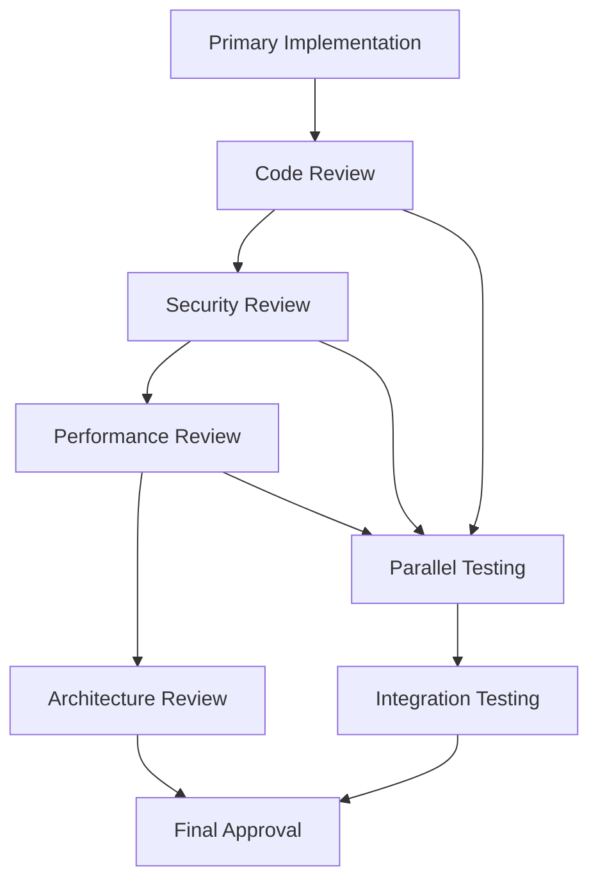

# 🚀 Advanced Features Guide - Master the Power Features

This guide covers the sophisticated capabilities that make the AI-CRM system truly powerful. From PM Gateway orchestration to advanced analytics and enterprise integrations, these features help you maximize productivity and efficiency.

## 📋 Table of Contents

1. [PM Gateway Advanced Features](#-pm-gateway-advanced-features)
2. [Multi-Agent Workflows](#-multi-agent-workflows)
3. [Advanced Analytics & Reporting](#-advanced-analytics--reporting)
4. [API Integration & Automation](#-api-integration--automation)
5. [Enterprise Features](#-enterprise-features)
6. [Custom Configurations](#-custom-configurations)
7. [Performance Optimization](#-performance-optimization)
8. [Advanced Security Features](#-advanced-security-features)
9. [Integration Patterns](#-integration-patterns)
10. [Power User Tips](#-power-user-tips)

## 🧠 PM Gateway Advanced Features

### Intelligent Project Orchestration

The PM Gateway goes beyond simple task analysis to provide sophisticated project management capabilities:

#### Complex Task Decomposition
```bash
# Advanced PM analysis with context awareness
python3 crm_enhanced.py pm --title "Migrate monolith to microservices" --description "
Current: Single Rails application with 500k+ LOC, PostgreSQL database
Target: Docker containerized microservices with API gateway
Constraints: Zero downtime migration, maintain data consistency
Timeline: 6 months, 4-person team
Compliance: SOC2, GDPR data handling requirements"

# Output includes:
# - Risk assessment matrix
# - Dependency graph with critical path
# - Resource allocation recommendations  
# - Compliance checkpoints
# - Rollback strategies
```

#### Strategic Planning Integration
```bash
# Business-driven project analysis
python3 crm_enhanced.py pm --title "Launch B2B marketplace" --description "
Business Goal: $2M ARR in 18 months
Target Market: Mid-market B2B procurement
Key Metrics: 10k+ registered buyers, 1k+ suppliers
Technical Stack: React, Node.js, AWS, Stripe
Competitors: Analysis of 3 major competitors included"

# PM Gateway provides:
# - Go-to-market timeline alignment
# - Technical architecture recommendations
# - Competitive feature analysis
# - Revenue milestone checkpoints
```

### Advanced Workflow Templates

#### Custom Workflow Creation
Create reusable workflows for your organization:

```python
# Example: Custom Security-First Development Workflow
security_workflow = {
    "name": "Security-First Feature Development",
    "phases": [
        {
            "name": "Security Design",
            "agent": "security-auditor",
            "duration": "16 hours",
            "deliverables": ["Threat model", "Security requirements"]
        },
        {
            "name": "Architecture Review", 
            "agent": "architect-reviewer",
            "duration": "8 hours",
            "dependencies": ["Security Design"],
            "deliverables": ["Architecture document", "Risk assessment"]
        },
        {
            "name": "Implementation",
            "agent": "auto-select",
            "duration": "40 hours", 
            "dependencies": ["Architecture Review"],
            "validation": ["security-auditor", "code-reviewer"]
        }
    ]
}
```

#### Workflow Automation Triggers
```bash
# Trigger workflows based on conditions
# Example: Auto-trigger security workflow for auth-related tasks
if "authentication" in task.description.lower():
    workflow = "security-first-development"
elif "payment" in task.description.lower():
    workflow = "pci-compliant-development"
elif "api" in task.description.lower():
    workflow = "api-first-development"
```

### Risk Management & Mitigation

#### Advanced Risk Analysis
The PM Gateway provides sophisticated risk assessment:

**Technical Risk Factors:**
- **Complexity Risk** - Code complexity metrics and refactoring needs
- **Integration Risk** - Dependency analysis and breaking change potential
- **Performance Risk** - Scalability concerns and bottleneck identification
- **Security Risk** - Vulnerability surface area and compliance requirements

**Business Risk Factors:**
- **Timeline Risk** - Deadline pressure and resource constraints
- **Market Risk** - Competitive threats and changing requirements
- **Resource Risk** - Team availability and skill gaps
- **Quality Risk** - Customer impact and reputation considerations

#### Mitigation Strategy Generation
```bash
# Example: High-risk project mitigation strategies
Risk: Legacy System Integration (High)
Mitigations:
1. Create abstraction layer with legacy-modernizer
2. Implement circuit breaker patterns with performance-engineer
3. Set up comprehensive monitoring with devops-troubleshooter  
4. Design rollback plan with database-admin
5. Schedule testing phases with test-automator
```

### Success Criteria & Quality Gates

#### Automated Quality Gates
```yaml
# Quality gate configuration
quality_gates:
  development:
    - name: "Code Review Gate"
      agent: "code-reviewer"
      criteria: ["SOLID principles", "Security scan", "Test coverage >80%"]
      blocking: true
    
    - name: "Performance Gate"  
      agent: "performance-engineer"
      criteria: ["Response time <200ms", "Memory usage <512MB"]
      blocking: false
      
  deployment:
    - name: "Security Gate"
      agent: "security-auditor"  
      criteria: ["Vulnerability scan", "Compliance check"]
      blocking: true
```

#### Success Metrics Tracking
- **Business Metrics** - ROI, user adoption, revenue impact
- **Technical Metrics** - Performance, reliability, maintainability  
- **Quality Metrics** - Defect rates, customer satisfaction
- **Process Metrics** - Delivery speed, estimation accuracy

## 🔄 Multi-Agent Workflows

### Advanced Orchestration Patterns

#### Parallel Agent Coordination
```python
# Example: Parallel optimization workflow
parallel_optimization = {
    "workflow_type": "parallel",
    "agents": {
        "performance-engineer": {
            "task": "Application profiling and bottleneck identification",
            "duration": "8 hours",
            "output": ["Performance report", "Optimization recommendations"]
        },
        "database-optimizer": {
            "task": "Query analysis and index optimization", 
            "duration": "6 hours",
            "output": ["Query optimization plan", "Index recommendations"]
        },
        "frontend-developer": {
            "task": "Client-side performance optimization",
            "duration": "12 hours", 
            "output": ["Bundle optimization", "Lazy loading implementation"]
        }
    },
    "merge_phase": {
        "agent": "architect-reviewer",
        "task": "Integrate optimization strategies",
        "duration": "4 hours"
    }
}
```

#### Conditional Agent Routing
```python
# Smart agent selection based on context
def select_agent_workflow(task_description, project_context):
    if "payment" in task_description.lower():
        return create_payment_workflow()
    elif "security" in task_description.lower():
        return create_security_workflow() 
    elif project_context.get("compliance") == "SOC2":
        return create_compliance_workflow()
    else:
        return create_standard_workflow()
```

#### Agent Handoff Protocols
```yaml
# Sophisticated handoff definitions
handoff_protocols:
  design_to_development:
    from_agent: "ui-ux-designer"
    to_agent: "frontend-developer"
    required_artifacts:
      - "Design system components"
      - "Responsive breakpoints"
      - "Accessibility requirements"
    validation_criteria:
      - "All designs have specifications"
      - "Components are documented"
      - "Accessibility standards defined"
    
  development_to_testing:
    from_agent: "python-pro"
    to_agent: "test-automator"
    required_artifacts:
      - "Feature implementation complete"
      - "API documentation updated"
      - "Local testing passed"
    validation_criteria:
      - "All acceptance criteria met"
      - "Error handling implemented" 
      - "Documentation is current"
```

### Dynamic Workflow Adaptation

#### Context-Aware Modifications
Workflows automatically adapt based on:
- **Project size and complexity**
- **Team composition and skills**
- **Timeline constraints** 
- **Quality requirements**
- **Compliance needs**

```python
# Example: Adaptive workflow based on project characteristics
def adapt_workflow(base_workflow, project_context):
    if project_context.urgency == "high":
        # Parallel phases where possible
        workflow.parallelize_compatible_phases()
        
    if project_context.compliance_required:
        # Add compliance checkpoints
        workflow.add_agent("legal-advisor", phase="review")
        
    if project_context.team_size > 10:
        # Add coordination agent
        workflow.add_agent("context-manager", phase="orchestration")
        
    return workflow
```

#### Real-time Workflow Optimization
- **Bottleneck Detection** - Identify and resolve workflow bottlenecks
- **Resource Reallocation** - Shift agents based on capacity and priorities
- **Timeline Adjustment** - Adapt to changing deadlines and constraints
- **Quality Optimization** - Add review stages for critical components

### Agent Collaboration Patterns

#### Review and Validation Chains


#### Cross-Functional Integration
- **Development + Operations** - DevOps collaboration patterns
- **Security + Development** - Security-integrated development
- **Business + Technical** - Business-driven technical decisions
- **Quality + Speed** - Balanced quality and delivery optimization

## 📊 Advanced Analytics & Reporting

### Business Intelligence Dashboard

#### Executive Metrics
```sql
-- Example: Advanced business analytics queries
SELECT 
    DATE_TRUNC('month', created_at) as month,
    COUNT(*) as tasks_created,
    COUNT(CASE WHEN status = 'done' THEN 1 END) as tasks_completed,
    AVG(completion_time_hours) as avg_completion_time,
    COUNT(DISTINCT assigned_agent) as agents_utilized,
    SUM(estimated_business_value) as total_business_value
FROM tasks 
WHERE created_at >= NOW() - INTERVAL '12 months'
GROUP BY DATE_TRUNC('month', created_at)
ORDER BY month;
```

#### Advanced KPI Tracking
- **Velocity Metrics** - Story points, task throughput, cycle time
- **Quality Metrics** - Defect density, rework percentage, customer satisfaction
- **Efficiency Metrics** - Resource utilization, estimation accuracy
- **Business Metrics** - Feature adoption, revenue impact, user engagement

#### Predictive Analytics
```python
# Example: Predictive completion time model
def predict_completion_time(task_features):
    features = [
        task_features['complexity_score'],
        task_features['agent_experience_level'],
        task_features['dependency_count'],
        task_features['similar_task_avg_time']
    ]
    
    # Machine learning model prediction
    predicted_hours = completion_model.predict([features])[0]
    confidence_interval = completion_model.predict_confidence([features])[0]
    
    return {
        'predicted_hours': predicted_hours,
        'confidence_lower': predicted_hours - confidence_interval,
        'confidence_upper': predicted_hours + confidence_interval
    }
```

### Advanced Reporting Features

#### Custom Report Builder
```yaml
# Example: Custom report configuration
report_config:
  name: "Sprint Performance Report"
  schedule: "weekly"
  recipients: ["team-lead@company.com", "pm@company.com"]
  
  metrics:
    - name: "Velocity"
      query: "tasks_completed_per_sprint" 
      visualization: "line_chart"
      
    - name: "Agent Utilization"
      query: "agent_hours_by_specialty"
      visualization: "stacked_bar"
      
    - name: "Quality Metrics"
      query: "defect_rates_by_component"
      visualization: "heat_map"
      
  filters:
    - field: "team"
      values: ["engineering", "product"]
    - field: "date_range" 
      values: ["last_30_days"]
```

#### Real-time Dashboards
- **Live Task Progress** - Real-time updates on active tasks
- **Agent Performance** - Current utilization and success rates
- **System Health** - API performance, error rates, uptime
- **Business Metrics** - Revenue impact, goal progress, user activity

#### Data Export & Integration
```python
# Advanced data export with custom formatting
def export_analytics_data(format_type, filters):
    data = query_analytics_database(filters)
    
    if format_type == "executive_summary":
        return generate_executive_report(data)
    elif format_type == "technical_deep_dive":
        return generate_technical_report(data)
    elif format_type == "api_integration":
        return format_for_api_consumption(data)
    else:
        return data.to_csv()
```

## 🔌 API Integration & Automation

### Advanced API Usage

#### Complex Workflow Automation
```python
# Example: Automated project setup workflow
import requests
from ai_crm_client import AIClient

client = AIClient(api_key="your_api_key")

def setup_new_project(project_spec):
    # 1. Create project structure with PM Gateway
    pm_analysis = client.pm.analyze(
        title=project_spec['name'],
        description=project_spec['description']
    )
    
    # 2. Create tasks based on PM recommendations
    tasks = []
    for subtask in pm_analysis['subtasks']:
        task = client.tasks.create(
            title=subtask['title'],
            description=subtask['description'],
            agent=subtask['recommended_agent'],
            estimated_hours=subtask['duration'],
            dependencies=subtask.get('dependencies', [])
        )
        tasks.append(task)
    
    # 3. Setup project monitoring
    webhook = client.webhooks.create(
        url=f"https://your-domain.com/webhook/{project_spec['id']}",
        events=['task.completed', 'task.blocked', 'project.milestone']
    )
    
    # 4. Generate project dashboard
    dashboard = client.analytics.create_dashboard(
        project_id=project_spec['id'],
        metrics=['velocity', 'quality', 'timeline']
    )
    
    return {
        'tasks': tasks,
        'webhook': webhook,
        'dashboard': dashboard
    }
```

#### Batch Operations & Optimization
```python
# Efficient batch processing for large datasets
def batch_create_tasks(task_list, batch_size=50):
    results = []
    
    for i in range(0, len(task_list), batch_size):
        batch = task_list[i:i + batch_size]
        
        # Use bulk API endpoint for efficiency
        response = client.tasks.bulk_create(batch)
        results.extend(response['created_tasks'])
        
        # Respect rate limits
        time.sleep(1)
    
    return results
```

#### Advanced Webhook Integrations
```python
# Sophisticated webhook handling with retry logic
@app.route('/webhook', methods=['POST'])
def handle_webhook():
    payload = request.json
    signature = request.headers.get('X-Signature')
    
    # Verify webhook authenticity
    if not verify_webhook_signature(payload, signature):
        return 'Unauthorized', 401
    
    # Process different event types
    event_handlers = {
        'task.completed': handle_task_completion,
        'task.blocked': handle_task_blocking,
        'agent.suggested': handle_agent_suggestion,
        'project.at_risk': handle_project_risk_alert
    }
    
    handler = event_handlers.get(payload['event'])
    if handler:
        try:
            result = handler(payload['data'])
            return {'status': 'processed', 'result': result}
        except Exception as e:
            # Log error and return for retry
            logger.error(f"Webhook processing failed: {e}")
            return 'Processing failed', 500
    
    return {'status': 'ignored'}

def handle_task_completion(task_data):
    # Trigger downstream actions
    if task_data['agent'] == 'frontend-developer':
        # Automatically create testing task
        create_testing_task(task_data)
    
    # Update project metrics
    update_project_velocity(task_data['project_id'])
    
    # Notify stakeholders
    send_completion_notification(task_data)
```

### Third-Party Integrations

#### Slack Integration
```python
# Advanced Slack bot integration
class SlackAICRMBot:
    def __init__(self, slack_token, aicrm_api_key):
        self.slack_client = WebClient(token=slack_token)
        self.aicrm_client = AIClient(api_key=aicrm_api_key)
    
    @slack_app.command("/create-task")
    def create_task_command(self, ack, body, client):
        ack()
        
        # Parse natural language task description
        text = body['text']
        
        # Use AI to analyze and create task
        analysis = self.aicrm_client.pm.analyze_text(text)
        
        # Create interactive modal for confirmation
        modal = self.build_task_confirmation_modal(analysis)
        client.views_open(trigger_id=body['trigger_id'], view=modal)
    
    def build_task_confirmation_modal(self, analysis):
        return {
            "type": "modal",
            "title": {"type": "plain_text", "text": "Create Task"},
            "blocks": [
                {
                    "type": "input",
                    "label": {"type": "plain_text", "text": "Title"},
                    "element": {
                        "type": "plain_text_input",
                        "initial_value": analysis['suggested_title']
                    }
                },
                {
                    "type": "section",
                    "text": {
                        "type": "mrkdwn", 
                        "text": f"*Recommended Agent:* {analysis['recommended_agent']} ({analysis['confidence']}% confidence)"
                    }
                }
            ]
        }
```

#### Jira Integration
```python
# Bi-directional Jira synchronization
class JiraSync:
    def __init__(self, jira_config, aicrm_client):
        self.jira = JIRA(
            server=jira_config['server'],
            basic_auth=(jira_config['username'], jira_config['api_token'])
        )
        self.aicrm = aicrm_client
    
    def sync_task_to_jira(self, task):
        # Create Jira issue with AI agent context
        issue_data = {
            'project': {'key': 'PROJ'},
            'summary': task['title'],
            'description': f"{task['description']}\n\nAI Agent: {task['agent']}",
            'issuetype': {'name': 'Story'},
            'customfield_agent': task['agent'],  # Custom field
            'customfield_confidence': task['agent_confidence']
        }
        
        jira_issue = self.jira.create_issue(fields=issue_data)
        
        # Link back to AI-CRM
        self.aicrm.tasks.add_external_link(
            task_id=task['id'],
            link_type='jira',
            external_id=jira_issue.key,
            url=f"{jira_config['server']}/browse/{jira_issue.key}"
        )
        
        return jira_issue
    
    def handle_jira_webhook(self, webhook_data):
        # Sync Jira updates back to AI-CRM
        if webhook_data['issue_event_type_name'] == 'issue_updated':
            jira_key = webhook_data['issue']['key']
            
            # Find corresponding AI-CRM task
            task = self.aicrm.tasks.find_by_external_link('jira', jira_key)
            
            if task:
                # Update status based on Jira workflow
                jira_status = webhook_data['issue']['fields']['status']['name']
                aicrm_status = self.map_jira_to_aicrm_status(jira_status)
                
                self.aicrm.tasks.update(task['id'], {'status': aicrm_status})
```

#### GitHub Integration
```python
# GitHub Actions integration for automated task updates
def handle_github_webhook(payload):
    if payload['action'] == 'closed' and payload['pull_request']['merged']:
        pr = payload['pull_request']
        
        # Extract task references from PR description
        task_pattern = r'AI-CRM-(\d+)'
        task_matches = re.findall(task_pattern, pr['body'])
        
        for task_id in task_matches:
            # Update task status to completed
            client.tasks.update(task_id, {
                'status': 'done',
                'completion_notes': f"Completed via PR #{pr['number']}: {pr['title']}"
            })
            
            # Add PR link to task
            client.tasks.add_external_link(
                task_id=task_id,
                link_type='github_pr',
                external_id=pr['number'],
                url=pr['html_url']
            )
```

## 🏢 Enterprise Features

### Single Sign-On (SSO) Integration

#### SAML Configuration
```xml
<!-- Example SAML configuration -->
<saml:AttributeStatement>
    <saml:Attribute Name="email">
        <saml:AttributeValue>user@company.com</saml:AttributeValue>
    </saml:Attribute>
    <saml:Attribute Name="role">
        <saml:AttributeValue>manager</saml:AttributeValue>
    </saml:Attribute>
    <saml:Attribute Name="department">
        <saml:AttributeValue>engineering</saml:AttributeValue>
    </saml:Attribute>
    <saml:Attribute Name="subscription_tier">
        <saml:AttributeValue>enterprise</saml:AttributeValue>
    </saml:Attribute>
</saml:AttributeStatement>
```

#### OAuth2/OIDC Integration
```python
# Enterprise OAuth configuration
oauth_config = {
    "provider": "azure_ad",
    "client_id": "your-enterprise-client-id",
    "client_secret": "your-client-secret", 
    "tenant_id": "your-azure-tenant",
    "scopes": ["openid", "profile", "email", "groups"],
    "user_mapping": {
        "email": "preferred_username",
        "name": "name",
        "role": "groups",  # Map from AD groups
        "department": "department"
    },
    "role_mapping": {
        "ai-crm-admin": "admin",
        "ai-crm-manager": "manager", 
        "ai-crm-user": "user"
    }
}
```

### Multi-Tenant Architecture

#### Organization Management
```python
# Multi-tenant organization structure
class Organization:
    def __init__(self, org_id, name, settings):
        self.id = org_id
        self.name = name
        self.settings = settings
        self.users = []
        self.teams = []
        self.custom_agents = []
    
    def create_custom_agent(self, agent_spec):
        """Create organization-specific AI agent"""
        custom_agent = CustomAgent(
            name=agent_spec['name'],
            specialization=agent_spec['specialization'],
            model=agent_spec['model'],
            tools=agent_spec['tools'],
            organization_id=self.id
        )
        self.custom_agents.append(custom_agent)
        return custom_agent
    
    def get_available_agents(self, user):
        """Get agents available to user based on subscription and org settings"""
        base_agents = get_base_agents_for_tier(user.subscription_tier)
        org_agents = self.custom_agents
        return base_agents + org_agents
```

#### Data Isolation & Security
```sql
-- Row-level security for multi-tenant data isolation
CREATE POLICY tenant_isolation ON tasks
    FOR ALL
    TO authenticated
    USING (organization_id = current_setting('app.current_organization_id')::uuid);

-- Ensure all queries are automatically filtered by organization
ALTER TABLE tasks ENABLE ROW LEVEL SECURITY;
ALTER TABLE users ENABLE ROW LEVEL SECURITY; 
ALTER TABLE analytics ENABLE ROW LEVEL SECURITY;
```

### Advanced Security Features

#### Advanced Audit Logging
```python
# Comprehensive audit trail
class AuditLogger:
    def log_event(self, event_type, user_id, resource_type, resource_id, 
                  action, details, risk_score=None):
        audit_record = {
            'timestamp': datetime.utcnow(),
            'event_type': event_type,  # login, task_create, data_export, etc.
            'user_id': user_id,
            'session_id': get_current_session_id(),
            'ip_address': get_client_ip(),
            'user_agent': get_user_agent(),
            'resource_type': resource_type,
            'resource_id': resource_id,
            'action': action,
            'details': details,
            'risk_score': risk_score or calculate_risk_score(event_type, details),
            'geo_location': get_geo_location(get_client_ip())
        }
        
        # Store in secure audit database
        self.audit_db.insert(audit_record)
        
        # Alert on high-risk activities
        if audit_record['risk_score'] > 80:
            self.send_security_alert(audit_record)
```

#### Data Loss Prevention (DLP)
```python
# DLP scanning for sensitive data
class DLPScanner:
    def __init__(self):
        self.patterns = {
            'ssn': r'\b\d{3}-?\d{2}-?\d{4}\b',
            'credit_card': r'\b\d{4}[-\s]?\d{4}[-\s]?\d{4}[-\s]?\d{4}\b',
            'email': r'\b[A-Za-z0-9._%+-]+@[A-Za-z0-9.-]+\.[A-Z|a-z]{2,}\b',
            'api_key': r'\b[A-Za-z0-9]{32,}\b'
        }
    
    def scan_task_content(self, task):
        violations = []
        
        for data_type, pattern in self.patterns.items():
            matches = re.findall(pattern, task['description'])
            if matches:
                violations.append({
                    'type': data_type,
                    'matches': len(matches),
                    'severity': self.get_severity(data_type)
                })
        
        if violations:
            self.handle_dlp_violation(task, violations)
        
        return violations
```

### Custom Agent Development

#### Agent Creation Framework
```python
# Framework for creating custom enterprise agents
class CustomAgentBuilder:
    def create_agent(self, specification):
        """Create custom agent from specification"""
        agent = CustomAgent(
            name=specification['name'],
            description=specification['description'],
            specialization_keywords=specification['keywords'],
            model=specification['model'],
            tools=specification.get('tools', self.default_tools),
            system_prompt=specification['system_prompt'],
            organization_id=specification['organization_id']
        )
        
        # Validate agent configuration
        if self.validate_agent(agent):
            self.register_agent(agent)
            return agent
        else:
            raise ValueError("Invalid agent configuration")
    
    def validate_agent(self, agent):
        """Validate custom agent configuration"""
        checks = [
            self.check_prompt_safety(agent.system_prompt),
            self.check_tool_permissions(agent.tools),
            self.check_model_availability(agent.model),
            self.check_naming_conflicts(agent.name)
        ]
        return all(checks)

# Example custom agent for specific industry
finance_compliance_agent = CustomAgentBuilder().create_agent({
    "name": "finance-compliance-specialist",
    "description": "SOX compliance and financial regulation expert",
    "keywords": ["sox", "compliance", "financial", "audit", "regulation"],
    "model": "opus",  # High capability for complex compliance analysis
    "system_prompt": """
    You are a financial compliance specialist expert in SOX, GAAP, and SEC regulations.
    Focus on ensuring all financial processes meet regulatory requirements.
    Provide specific guidance on internal controls and audit requirements.
    """,
    "tools": ["Read", "Edit", "Grep", "WebFetch"],  # No code execution for security
    "organization_id": "enterprise-org-123"
})
```

## ⚙️ Custom Configurations

### Environment-Specific Configurations

#### Development Environment
```yaml
# config/development.yml
environment: development
debug: true
logging:
  level: DEBUG
  console: true
  file: ./logs/dev.log

ai_models:
  default_selection: "sonnet"  # Balanced for development
  enable_model_override: true
  rate_limits:
    requests_per_minute: 100
    
database:
  connection_pool: 5
  query_timeout: 30
  enable_sql_logging: true

features:
  beta_features: true
  experimental_agents: true
  performance_profiling: true
```

#### Production Environment  
```yaml
# config/production.yml
environment: production
debug: false
logging:
  level: INFO
  console: false
  file: /var/log/aicrm/prod.log
  structured: true

ai_models:
  default_selection: "auto"  # Smart selection based on complexity
  model_fallback: true
  rate_limits:
    requests_per_minute: 60
    burst_allowance: 10

database:
  connection_pool: 20
  query_timeout: 10
  enable_readonly_replica: true

security:
  force_https: true
  hsts_enabled: true
  session_timeout: 3600
  
monitoring:
  health_check_interval: 30
  metrics_collection: true
  alert_thresholds:
    error_rate: 0.05
    response_time_p95: 500
```

### Agent Behavior Customization

#### Custom Agent Policies
```python
# Define custom behavior policies for agents
agent_policies = {
    "security-auditor": {
        "always_require_review": True,
        "escalate_on_high_risk": True,
        "compliance_frameworks": ["SOC2", "GDPR", "HIPAA"],
        "auto_create_security_tasks": True
    },
    
    "performance-engineer": {
        "performance_thresholds": {
            "response_time": 200,  # milliseconds
            "memory_usage": 512,   # MB
            "cpu_usage": 70        # percentage
        },
        "auto_profiling": True,
        "optimization_suggestions": "aggressive"
    },
    
    "code-reviewer": {
        "review_checklist": [
            "SOLID principles compliance",
            "Security vulnerability scan", 
            "Test coverage verification",
            "Documentation completeness"
        ],
        "auto_reject_on_security_issues": True,
        "require_tests_for_new_code": True
    }
}
```

#### Workflow Customization
```yaml
# Custom workflow templates
workflows:
  enterprise_security_workflow:
    name: "Enterprise Security Development"
    trigger_conditions:
      - keyword_match: ["authentication", "authorization", "security"]
      - risk_level: "high"
    
    phases:
      - name: "Threat Modeling"
        agent: "security-auditor"
        duration: 8
        required: true
        
      - name: "Secure Design Review"
        agent: "architect-reviewer" 
        duration: 4
        depends_on: ["Threat Modeling"]
        
      - name: "Implementation"
        agent: "auto-select"
        duration: "variable"
        review_required: true
        
      - name: "Security Testing"
        agent: "test-automator"
        duration: 6
        specialized_tests: ["penetration", "vulnerability_scan"]
        
      - name: "Compliance Validation"
        agent: "legal-advisor"
        duration: 2
        frameworks: ["SOC2", "GDPR"]
```

## 🚀 Performance Optimization

### Advanced Caching Strategies

#### Multi-Level Caching
```python
# Sophisticated caching architecture
class CacheManager:
    def __init__(self):
        self.memory_cache = TTLCache(maxsize=1000, ttl=300)  # 5 min
        self.redis_cache = redis.Redis(host='redis-server')
        self.disk_cache = DiskCache('/tmp/aicrm_cache')
    
    def get(self, key):
        # L1: Memory cache (fastest)
        if key in self.memory_cache:
            return self.memory_cache[key]
        
        # L2: Redis cache (fast)
        redis_value = self.redis_cache.get(key)
        if redis_value:
            value = pickle.loads(redis_value)
            self.memory_cache[key] = value
            return value
        
        # L3: Disk cache (slower but persistent)
        if key in self.disk_cache:
            value = self.disk_cache[key]
            self.redis_cache.setex(key, 3600, pickle.dumps(value))
            self.memory_cache[key] = value
            return value
        
        return None
    
    def set(self, key, value, ttl=3600):
        # Store in all cache levels
        self.memory_cache[key] = value
        self.redis_cache.setex(key, ttl, pickle.dumps(value))
        self.disk_cache.set(key, value, expire=ttl)
```

#### Intelligent Cache Invalidation
```python
# Smart cache invalidation based on data dependencies
class SmartCacheInvalidator:
    def __init__(self, cache_manager):
        self.cache = cache_manager
        self.dependency_graph = {
            'task_list': ['user_tasks', 'project_summary', 'analytics_dashboard'],
            'agent_assignments': ['task_suggestions', 'workload_metrics'],
            'user_profile': ['permissions', 'subscription_features']
        }
    
    def invalidate_on_change(self, changed_entity):
        """Invalidate caches that depend on changed entity"""
        to_invalidate = self.dependency_graph.get(changed_entity, [])
        to_invalidate.append(changed_entity)  # Invalidate the entity itself
        
        for cache_key in to_invalidate:
            self.cache.delete(cache_key)
            
        # Trigger background refresh for critical caches
        if changed_entity in ['task_list', 'agent_assignments']:
            self.background_refresh(to_invalidate)
```

### Database Optimization

#### Query Optimization Patterns
```sql
-- Advanced indexing strategies
CREATE INDEX CONCURRENTLY idx_tasks_status_created 
ON tasks (status, created_at) 
WHERE status IN ('to_do', 'in_progress');

-- Partial index for active tasks only
CREATE INDEX CONCURRENTLY idx_tasks_active_agent
ON tasks (assigned_agent, priority)
WHERE status != 'done' AND status != 'cancelled';

-- Composite index for analytics queries
CREATE INDEX CONCURRENTLY idx_analytics_date_agent_status
ON tasks (DATE(created_at), assigned_agent, status)
INCLUDE (estimated_hours, actual_hours);
```

#### Connection Pool Management
```python
# Advanced database connection management
class DatabaseManager:
    def __init__(self, config):
        self.read_pool = create_pool(
            config['read_database_url'],
            min_connections=5,
            max_connections=20,
            command_timeout=10
        )
        
        self.write_pool = create_pool(
            config['write_database_url'],
            min_connections=2,
            max_connections=10,
            command_timeout=30
        )
    
    async def execute_read(self, query, params=None):
        async with self.read_pool.acquire() as conn:
            return await conn.fetch(query, *(params or []))
    
    async def execute_write(self, query, params=None):
        async with self.write_pool.acquire() as conn:
            async with conn.transaction():
                return await conn.execute(query, *(params or []))
```

### API Performance Optimization

#### Request Batching and Optimization
```python
# Batch API operations for efficiency
class BatchProcessor:
    def __init__(self, max_batch_size=100, flush_interval=1.0):
        self.max_batch_size = max_batch_size
        self.flush_interval = flush_interval
        self.pending_operations = []
        self.last_flush = time.time()
    
    async def add_operation(self, operation):
        self.pending_operations.append(operation)
        
        # Auto-flush if batch is full or interval elapsed
        if (len(self.pending_operations) >= self.max_batch_size or 
            time.time() - self.last_flush > self.flush_interval):
            await self.flush()
    
    async def flush(self):
        if not self.pending_operations:
            return
        
        # Group operations by type for efficient processing
        grouped_ops = self.group_operations(self.pending_operations)
        
        results = []
        for op_type, ops in grouped_ops.items():
            batch_results = await self.execute_batch(op_type, ops)
            results.extend(batch_results)
        
        self.pending_operations.clear()
        self.last_flush = time.time()
        
        return results
```

#### Response Compression and Optimization
```python
# Advanced response optimization
@app.middleware('http')
async def optimize_response(request: Request, call_next):
    response = await call_next(request)
    
    # Enable compression for large responses
    if int(response.headers.get('content-length', 0)) > 1000:
        response.headers['content-encoding'] = 'gzip'
        response.body = gzip.compress(response.body)
    
    # Add caching headers for static content
    if request.url.path.startswith('/static/'):
        response.headers['cache-control'] = 'public, max-age=31536000'
    
    # Add performance headers
    response.headers['x-response-time'] = str(time.time() - request.state.start_time)
    
    return response
```

## 🔐 Advanced Security Features

### Zero-Trust Security Model

#### Request Authentication and Authorization
```python
# Zero-trust security implementation
class ZeroTrustAuthenticator:
    def __init__(self):
        self.device_fingerprinter = DeviceFingerprinter()
        self.risk_evaluator = RiskEvaluator()
        self.mfa_enforcer = MFAEnforcer()
    
    async def authenticate_request(self, request):
        # Step 1: Verify JWT token
        token = extract_jwt_token(request)
        user = await self.verify_jwt(token)
        
        # Step 2: Device fingerprinting
        device_fingerprint = self.device_fingerprinter.generate(request)
        device_trust = await self.evaluate_device_trust(user.id, device_fingerprint)
        
        # Step 3: Risk assessment
        risk_score = await self.risk_evaluator.calculate_risk(
            user=user,
            request=request,
            device_trust=device_trust
        )
        
        # Step 4: Conditional MFA enforcement
        if risk_score > 70:
            mfa_required = await self.mfa_enforcer.require_verification(user)
            if not mfa_required:
                raise SecurityException("MFA verification required")
        
        # Step 5: Context-aware permissions
        permissions = await self.get_contextual_permissions(
            user, request, risk_score
        )
        
        return AuthenticationContext(
            user=user,
            permissions=permissions,
            risk_score=risk_score,
            device_fingerprint=device_fingerprint
        )
```

#### Advanced Threat Detection
```python
# AI-powered threat detection
class ThreatDetector:
    def __init__(self):
        self.anomaly_detector = AnomalyDetector()
        self.behavior_analyzer = BehaviorAnalyzer()
        
    async def analyze_request(self, request, user_context):
        threats = []
        
        # Detect unusual access patterns
        access_anomaly = await self.anomaly_detector.check_access_pattern(
            user_id=user_context.user.id,
            resource=request.url.path,
            timestamp=datetime.utcnow()
        )
        
        if access_anomaly.score > 0.8:
            threats.append({
                'type': 'unusual_access_pattern',
                'score': access_anomaly.score,
                'details': access_anomaly.explanation
            })
        
        # Analyze user behavior
        behavior_risk = await self.behavior_analyzer.analyze(
            user=user_context.user,
            actions=request.method,
            data_access_pattern=self.extract_data_access(request)
        )
        
        if behavior_risk.is_suspicious:
            threats.append({
                'type': 'suspicious_behavior',
                'score': behavior_risk.score,
                'details': behavior_risk.indicators
            })
        
        return threats
```

### Data Encryption and Privacy

#### Field-Level Encryption
```python
# Transparent field-level encryption
class FieldEncryption:
    def __init__(self, encryption_key):
        self.cipher = Fernet(encryption_key)
        self.encrypted_fields = {
            'users': ['email', 'phone'],
            'tasks': ['description'],  # Encrypt sensitive task details
            'comments': ['content']
        }
    
    def encrypt_sensitive_data(self, table_name, data):
        """Automatically encrypt sensitive fields before database storage"""
        if table_name not in self.encrypted_fields:
            return data
        
        encrypted_data = data.copy()
        for field in self.encrypted_fields[table_name]:
            if field in encrypted_data:
                encrypted_data[field] = self.cipher.encrypt(
                    encrypted_data[field].encode()
                ).decode()
        
        return encrypted_data
    
    def decrypt_sensitive_data(self, table_name, data):
        """Automatically decrypt sensitive fields after database retrieval"""
        if table_name not in self.encrypted_fields:
            return data
        
        decrypted_data = data.copy()
        for field in self.encrypted_fields[table_name]:
            if field in decrypted_data:
                decrypted_data[field] = self.cipher.decrypt(
                    decrypted_data[field].encode()
                ).decode()
        
        return decrypted_data
```

#### Privacy-Preserving Analytics
```python
# Differential privacy for analytics
class PrivacyPreservingAnalytics:
    def __init__(self, epsilon=1.0):
        self.epsilon = epsilon  # Privacy budget
        
    def private_count(self, data, condition):
        """Count with differential privacy noise"""
        true_count = len([item for item in data if condition(item)])
        noise = np.random.laplace(0, 1/self.epsilon)
        return max(0, int(true_count + noise))
    
    def private_average(self, values, sensitivity=1.0):
        """Calculate average with differential privacy"""
        if not values:
            return 0
        
        true_avg = sum(values) / len(values)
        noise = np.random.laplace(0, sensitivity / (len(values) * self.epsilon))
        return true_avg + noise
    
    def generate_private_report(self, tasks):
        """Generate analytics report with privacy guarantees"""
        return {
            'total_tasks': self.private_count(tasks, lambda t: True),
            'completed_tasks': self.private_count(tasks, lambda t: t.status == 'done'),
            'average_completion_time': self.private_average([t.completion_time for t in tasks if t.completion_time]),
            'agent_utilization': self.private_agent_utilization(tasks)
        }
```

## 🔗 Integration Patterns

### Event-Driven Architecture

#### Advanced Event Sourcing
```python
# Event sourcing for task management
class TaskEventStore:
    def __init__(self):
        self.events = []
        self.snapshots = {}
    
    def append_event(self, task_id, event):
        event_record = {
            'task_id': task_id,
            'event_type': event['type'],
            'event_data': event['data'],
            'timestamp': datetime.utcnow(),
            'user_id': event.get('user_id'),
            'sequence_number': self.get_next_sequence(task_id)
        }
        
        self.events.append(event_record)
        
        # Publish event to external systems
        self.publish_event(event_record)
    
    def replay_events(self, task_id, from_sequence=0):
        """Replay events to rebuild task state"""
        events = [e for e in self.events 
                 if e['task_id'] == task_id and e['sequence_number'] > from_sequence]
        
        # Start from snapshot if available
        task_state = self.snapshots.get(task_id, {})
        
        # Apply events to rebuild state
        for event in events:
            task_state = self.apply_event(task_state, event)
        
        return task_state
    
    def create_snapshot(self, task_id):
        """Create state snapshot for performance optimization"""
        current_state = self.replay_events(task_id)
        self.snapshots[task_id] = current_state
        return current_state
```

#### Message Queue Integration
```python
# Advanced message queue patterns
class MessageRouter:
    def __init__(self):
        self.queues = {
            'task_updates': Queue('task-updates', durable=True),
            'agent_assignments': Queue('agent-assignments', durable=True), 
            'analytics_events': Queue('analytics', durable=True),
            'notifications': Queue('notifications', durable=True)
        }
    
    async def route_event(self, event):
        """Intelligently route events to appropriate queues"""
        routing_rules = {
            'task.created': ['task_updates', 'analytics_events'],
            'task.assigned': ['agent_assignments', 'notifications'],
            'task.completed': ['task_updates', 'analytics_events', 'notifications'],
            'user.login': ['analytics_events'],
            'security.alert': ['notifications']  # High priority queue
        }
        
        target_queues = routing_rules.get(event['type'], ['task_updates'])
        
        # Add routing metadata
        enriched_event = {
            **event,
            'routing_metadata': {
                'timestamp': datetime.utcnow().isoformat(),
                'source_system': 'ai-crm',
                'correlation_id': str(uuid.uuid4())
            }
        }
        
        # Publish to all target queues
        for queue_name in target_queues:
            await self.queues[queue_name].publish(enriched_event)
```

### Microservices Communication

#### Service Mesh Integration
```yaml
# Kubernetes service mesh configuration
apiVersion: v1
kind: Service
metadata:
  name: aicrm-task-service
  annotations:
    service-mesh.io/inject: "true"
    service-mesh.io/timeout: "30s"
    service-mesh.io/retry-attempts: "3"
    service-mesh.io/circuit-breaker: "true"
spec:
  ports:
  - port: 8080
    name: http
  selector:
    app: task-service
---
apiVersion: networking.istio.io/v1beta1
kind: VirtualService
metadata:
  name: aicrm-routing
spec:
  http:
  - match:
    - uri:
        prefix: "/api/v1/tasks"
    route:
    - destination:
        host: task-service
        subset: v1
      weight: 90
    - destination:
        host: task-service
        subset: v2
      weight: 10  # Canary deployment
```

#### Circuit Breaker Pattern
```python
# Advanced circuit breaker implementation
class CircuitBreaker:
    def __init__(self, failure_threshold=5, recovery_timeout=60, expected_exception=Exception):
        self.failure_threshold = failure_threshold
        self.recovery_timeout = recovery_timeout
        self.expected_exception = expected_exception
        
        self.failure_count = 0
        self.last_failure_time = None
        self.state = 'CLOSED'  # CLOSED, OPEN, HALF_OPEN
    
    async def call(self, func, *args, **kwargs):
        if self.state == 'OPEN':
            if self._should_attempt_reset():
                self.state = 'HALF_OPEN'
            else:
                raise CircuitBreakerOpenException("Circuit breaker is OPEN")
        
        try:
            result = await func(*args, **kwargs)
            self._on_success()
            return result
        except self.expected_exception as e:
            self._on_failure()
            raise e
    
    def _should_attempt_reset(self):
        return (time.time() - self.last_failure_time) > self.recovery_timeout
    
    def _on_success(self):
        self.failure_count = 0
        self.state = 'CLOSED'
    
    def _on_failure(self):
        self.failure_count += 1
        self.last_failure_time = time.time()
        if self.failure_count >= self.failure_threshold:
            self.state = 'OPEN'

# Usage with external services
agent_service_breaker = CircuitBreaker(failure_threshold=3, recovery_timeout=30)

async def call_agent_service(task_data):
    return await agent_service_breaker.call(
        external_agent_service.analyze_task, 
        task_data
    )
```

## 💡 Power User Tips

### Advanced Workflow Automation

#### Custom Automation Scripts
```python
# Example: Automated project setup and monitoring
class ProjectAutomator:
    def __init__(self, aicrm_client):
        self.client = aicrm_client
    
    async def setup_project_workflow(self, project_spec):
        """Fully automated project setup"""
        
        # 1. Create project structure
        pm_analysis = await self.client.pm.analyze(
            title=project_spec['name'],
            description=project_spec['requirements']
        )
        
        # 2. Create and link tasks
        tasks = []
        for subtask_spec in pm_analysis['subtasks']:
            task = await self.client.tasks.create({
                'title': subtask_spec['title'],
                'description': subtask_spec['description'],
                'agent': subtask_spec['agent'],
                'estimated_hours': subtask_spec['hours'],
                'project_id': project_spec['id']
            })
            tasks.append(task)
        
        # 3. Setup dependencies
        await self.link_task_dependencies(tasks, pm_analysis['dependencies'])
        
        # 4. Configure monitoring
        await self.setup_project_monitoring(project_spec['id'], tasks)
        
        # 5. Create stakeholder notifications
        await self.setup_stakeholder_alerts(project_spec)
        
        return {
            'project_id': project_spec['id'],
            'tasks_created': len(tasks),
            'estimated_duration': sum(t['estimated_hours'] for t in tasks),
            'monitoring_configured': True
        }
```

#### Intelligent Task Prioritization
```python
# AI-powered task prioritization
class SmartPrioritizer:
    def __init__(self, historical_data):
        self.model = self.train_priority_model(historical_data)
    
    def calculate_priority_score(self, task):
        features = self.extract_features(task)
        priority_score = self.model.predict([features])[0]
        
        # Adjust based on business rules
        if task.get('customer_impact') == 'high':
            priority_score *= 1.5
        
        if task.get('deadline') and self.is_deadline_approaching(task['deadline']):
            priority_score *= 1.3
        
        return min(priority_score, 100)  # Cap at 100
    
    def extract_features(self, task):
        return [
            len(task.get('description', '')),  # Task complexity indicator
            task.get('estimated_hours', 8),    # Time investment
            self.get_agent_availability_score(task.get('agent')),
            self.get_business_value_score(task),
            self.get_technical_risk_score(task)
        ]
    
    def reorder_backlog(self, tasks):
        """Intelligently reorder entire backlog"""
        prioritized_tasks = []
        
        for task in tasks:
            priority_score = self.calculate_priority_score(task)
            task['ai_priority_score'] = priority_score
            prioritized_tasks.append(task)
        
        return sorted(prioritized_tasks, 
                     key=lambda t: t['ai_priority_score'], 
                     reverse=True)
```

### Advanced Analytics and Insights

#### Custom Metrics Development
```python
# Build custom business metrics
class CustomMetricsEngine:
    def __init__(self, data_source):
        self.data = data_source
        
    def developer_velocity_metric(self, developer_id, period_days=30):
        """Calculate developer velocity with multiple dimensions"""
        end_date = datetime.now()
        start_date = end_date - timedelta(days=period_days)
        
        tasks = self.data.get_completed_tasks(
            assignee=developer_id, 
            date_range=(start_date, end_date)
        )
        
        metrics = {
            'tasks_completed': len(tasks),
            'story_points_completed': sum(t.get('story_points', 0) for t in tasks),
            'average_cycle_time': self.calculate_average_cycle_time(tasks),
            'code_quality_score': self.calculate_quality_score(tasks),
            'collaboration_score': self.calculate_collaboration_score(tasks)
        }
        
        # Normalize to 0-100 scale
        velocity_score = self.normalize_velocity_score(metrics)
        
        return {
            **metrics,
            'velocity_score': velocity_score,
            'trend': self.calculate_trend(developer_id, period_days)
        }
    
    def team_efficiency_metric(self, team_id, period_days=30):
        """Calculate team-level efficiency metrics"""
        team_tasks = self.data.get_team_tasks(team_id, period_days)
        
        return {
            'throughput': len(team_tasks) / (period_days / 7),  # Tasks per week
            'lead_time': self.calculate_lead_time(team_tasks),
            'blocked_time_ratio': self.calculate_blocked_time_ratio(team_tasks),
            'rework_percentage': self.calculate_rework_percentage(team_tasks),
            'agent_utilization': self.calculate_agent_utilization(team_tasks)
        }
```

#### Predictive Analytics
```python
# Predictive models for project management
class PredictiveAnalytics:
    def __init__(self):
        self.completion_model = self.load_completion_model()
        self.risk_model = self.load_risk_model()
    
    def predict_project_completion(self, project_tasks):
        """Predict project completion date with confidence intervals"""
        features = self.extract_project_features(project_tasks)
        
        # Monte Carlo simulation for uncertainty
        completion_estimates = []
        for _ in range(1000):
            estimate = self.completion_model.predict(features)[0]
            # Add uncertainty based on historical variance
            uncertainty = np.random.normal(0, self.historical_variance)
            completion_estimates.append(estimate + uncertainty)
        
        return {
            'predicted_days': np.mean(completion_estimates),
            'confidence_50': np.percentile(completion_estimates, 50),
            'confidence_80': np.percentile(completion_estimates, 80),
            'confidence_95': np.percentile(completion_estimates, 95),
            'risk_factors': self.identify_risk_factors(project_tasks)
        }
    
    def predict_task_success_probability(self, task):
        """Predict likelihood of task completion on time"""
        features = [
            task.get('complexity_score', 5),
            self.get_agent_success_rate(task.get('agent')),
            task.get('estimated_hours', 8),
            len(task.get('dependencies', [])),
            self.get_similar_task_success_rate(task)
        ]
        
        success_probability = self.completion_model.predict_proba([features])[0][1]
        
        return {
            'success_probability': success_probability,
            'risk_level': self.categorize_risk(success_probability),
            'recommendations': self.generate_success_recommendations(task, features)
        }
```

This comprehensive advanced features guide provides the knowledge and tools needed to fully leverage the sophisticated capabilities of the AI-CRM system. From PM Gateway orchestration to enterprise integrations and custom automation, these features enable organizations to achieve maximum productivity and efficiency in their project management workflows.