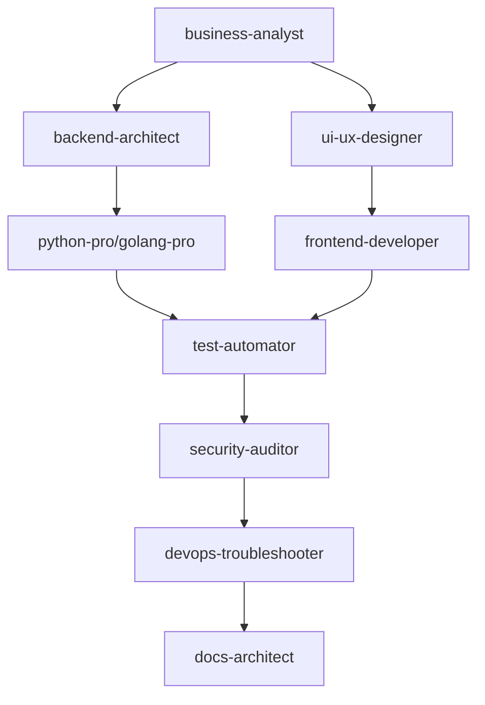
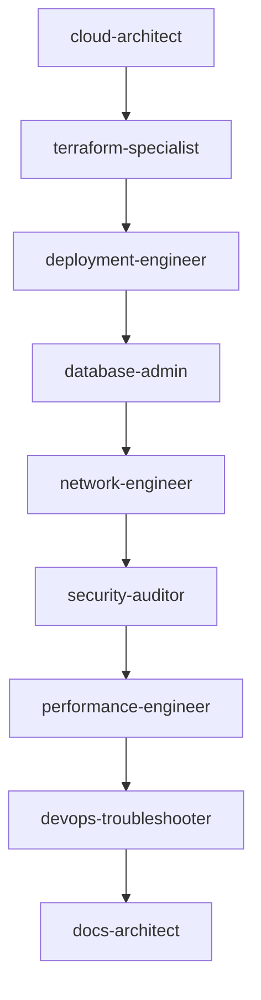
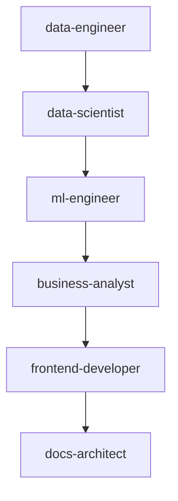

# 🤖 AI Agent Guide - Master the 59+ Specialists

This comprehensive guide helps you understand and effectively use the 59+ specialized AI agents in the AI-CRM system. Each agent is an expert in their domain, optimized for specific types of tasks and challenges.

## 📋 Table of Contents

1. [Agent Overview](#-agent-overview)
2. [Development & Architecture Agents](#-development--architecture-agents)
3. [Infrastructure & Operations Agents](#️-infrastructure--operations-agents)
4. [Quality & Security Agents](#-quality--security-agents)
5. [Data & AI Agents](#-data--ai-agents)
6. [Documentation & Communication Agents](#-documentation--communication-agents)
7. [Business & Strategy Agents](#-business--strategy-agents)
8. [Specialized Domain Agents](#-specialized-domain-agents)
9. [Agent Selection Strategies](#-agent-selection-strategies)
10. [Multi-Agent Workflows](#-multi-agent-workflows)
11. [Best Practices](#-best-practices)

## 🎯 Agent Overview

### Agent Classification System

All agents are organized into clear categories with specific model assignments based on task complexity:

- **🚀 Haiku (9 agents)** - Fast, cost-effective for simple tasks
- **⚡ Sonnet (37 agents)** - Balanced performance for most development work  
- **🧠 Opus (13 agents)** - Maximum capability for complex analysis and critical tasks

### How Agents Work

Each agent is essentially a specialized AI expert with:
- **Domain Expertise** - Deep knowledge in specific technical areas
- **Tool Access** - Appropriate tools for their specialization
- **Model Assignment** - Optimized Claude model for their complexity level
- **Keyword Recognition** - Responds to specific terms and contexts
- **Collaboration Patterns** - Works well with complementary agents

## 🔧 Development & Architecture Agents

### Language Specialists

#### `python-pro` (Sonnet)
**Specialization:** Advanced Python development with modern features and optimization
**Best For:**
- Backend API development with FastAPI/Django
- Data processing and automation scripts
- Machine learning pipeline development
- Package management and virtual environments
- Performance optimization and profiling

**Keywords:** python, django, fastapi, flask, pandas, numpy, automation, backend, api
**Tools:** Full development toolkit including code execution

**Example Tasks:**
```bash
"Optimize Python API performance with async/await patterns"
"Build data processing pipeline with pandas and SQLAlchemy"
"Implement JWT authentication in FastAPI application"
"Create automated testing suite with pytest and fixtures"
```

#### `javascript-pro` (Sonnet)
**Specialization:** Modern JavaScript with ES6+, async patterns, and Node.js APIs
**Best For:**
- Node.js backend development
- Modern JavaScript (ES6+, modules, async/await)
- Event-driven programming and websockets
- NPM package management and build tools
- Browser and Node.js compatibility issues

**Keywords:** javascript, node, nodejs, express, async, promise, webpack, babel, npm
**Tools:** Full development toolkit

**Example Tasks:**
```bash
"Implement real-time WebSocket connection with Socket.io"
"Build Express.js REST API with middleware and error handling"
"Optimize JavaScript bundle size with webpack and tree shaking"
"Create Node.js event-driven architecture for microservices"
```

#### `typescript-pro` (Sonnet)
**Specialization:** Advanced TypeScript with strict type safety and enterprise patterns
**Best For:**
- Large-scale TypeScript applications
- Advanced type systems and generics
- Enterprise-grade patterns and architectures
- Type inference optimization
- Migration from JavaScript to TypeScript

**Keywords:** typescript, types, generics, interfaces, decorators, strict, enterprise
**Tools:** Full development toolkit

**Example Tasks:**
```bash
"Implement advanced TypeScript generics for API client library"
"Migrate large JavaScript codebase to TypeScript with strict mode"
"Design type-safe event system with mapped types"
"Create enterprise TypeScript architecture with dependency injection"
```

#### `golang-pro` (Sonnet)
**Specialization:** Idiomatic Go with goroutines, channels, and high-performance systems
**Best For:**
- Concurrent programming with goroutines and channels
- High-performance microservices
- System programming and networking
- Docker and containerization
- CLI tools and utilities

**Keywords:** go, golang, goroutines, channels, concurrent, microservices, docker
**Tools:** Full development toolkit

**Example Tasks:**
```bash
"Build concurrent file processor using goroutines and channels"
"Create high-performance HTTP API server with Go stdlib"
"Implement graceful shutdown patterns for microservices"
"Design Go-based CLI tool with cobra and viper"
```

#### `rust-pro` (Sonnet)
**Specialization:** Memory-safe systems programming with ownership patterns
**Best For:**
- Systems programming and low-level optimization
- Memory safety and zero-cost abstractions
- High-performance applications
- WebAssembly development
- Embedded systems programming

**Keywords:** rust, memory, safety, ownership, performance, wasm, embedded, systems
**Tools:** Full development toolkit

**Example Tasks:**
```bash
"Optimize Rust application for zero-allocation performance"
"Implement safe concurrent data structures with Arc and Mutex"
"Build WebAssembly module for browser-based computation"
"Create embedded system firmware with no_std Rust"
```

#### `java-pro` (Sonnet)
**Specialization:** Modern Java with streams, concurrency, and enterprise frameworks
**Best For:**
- Enterprise Java applications
- Spring Boot and Spring Framework
- JVM optimization and performance tuning
- Concurrent programming with java.util.concurrent
- Microservices with Java

**Keywords:** java, spring, springboot, jvm, enterprise, concurrent, streams, maven
**Tools:** Full development toolkit

**Example Tasks:**
```bash
"Build Spring Boot microservice with reactive programming"
"Optimize JVM performance for high-throughput applications"
"Implement Java concurrent collections for thread-safe operations"
"Design enterprise Java architecture with Spring Cloud"
```

#### `csharp-pro` (Sonnet)
**Specialization:** Modern C# with .NET frameworks and enterprise patterns
**Best For:**
- .NET Core and .NET Framework applications
- ASP.NET Core web applications
- Entity Framework and data access
- Azure cloud integration
- Enterprise software architecture

**Keywords:** csharp, dotnet, aspnet, entity, framework, azure, enterprise
**Tools:** Full development toolkit

**Example Tasks:**
```bash
"Build ASP.NET Core API with Entity Framework and identity"
"Optimize .NET application performance with memory profiling"
"Implement CQRS pattern in C# with MediatR"
"Create Azure Functions for serverless C# applications"
```

### Frontend Specialists

#### `frontend-developer` (Sonnet)
**Specialization:** React components, responsive layouts, and client-side state management
**Best For:**
- React and modern JavaScript frameworks
- Responsive web design and CSS
- State management (Redux, Context API)
- Component architecture and design systems
- Performance optimization for web applications

**Keywords:** react, frontend, ui, css, html, responsive, components, state, redux
**Tools:** Full development toolkit

**Example Tasks:**
```bash
"Build responsive React dashboard with drag-and-drop functionality"
"Implement Redux state management with async actions"
"Create reusable component library with Storybook"
"Optimize React app performance with lazy loading and memoization"
```

#### `ui-ux-designer` (Sonnet)
**Specialization:** Interface design, wireframes, design systems, and user research
**Best For:**
- User interface and user experience design
- Wireframing and prototyping
- Design systems and style guides
- User research and usability testing
- Accessibility and inclusive design

**Keywords:** ui, ux, design, wireframe, prototype, accessibility, user, interface
**Tools:** Design and analysis tools

**Example Tasks:**
```bash
"Design user-friendly onboarding flow with wireframes"
"Create comprehensive design system for web application"
"Conduct usability analysis and recommend improvements"
"Design accessible interface following WCAG guidelines"
```

### Architecture Specialists

#### `backend-architect` (Sonnet)
**Specialization:** RESTful APIs, microservice boundaries, and database schemas
**Best For:**
- API design and REST architecture
- Microservices design and boundaries
- Database schema design and relationships
- System architecture and scalability planning
- Integration patterns and data flow

**Keywords:** api, rest, microservices, architecture, database, schema, integration
**Tools:** Full development toolkit

**Example Tasks:**
```bash
"Design RESTful API architecture for e-commerce platform"
"Plan microservices boundaries and communication patterns"
"Create database schema with proper normalization"
"Architect event-driven system with message queues"
```

#### `architect-reviewer` (Opus)
**Specialization:** Architectural consistency, design patterns, and system review
**Best For:**
- Code and architecture reviews
- Design pattern validation
- System architecture assessment
- Technical debt analysis
- Scalability and maintainability review

**Keywords:** review, architecture, patterns, consistency, scalability, maintainability
**Tools:** Analysis and review tools

**Example Tasks:**
```bash
"Review microservices architecture for scalability issues"
"Analyze system design for SOLID principle compliance"
"Evaluate technical debt and modernization opportunities"
"Assess API design for RESTful best practices"
```

## 🏗️ Infrastructure & Operations Agents

### DevOps Specialists

#### `devops-troubleshooter` (Sonnet)
**Specialization:** Production debugging, deployment failures, and system monitoring
**Best For:**
- Production issue diagnosis and resolution
- Deployment pipeline debugging
- Log analysis and error investigation
- Performance monitoring and alerting
- Infrastructure troubleshooting

**Keywords:** devops, production, deployment, logs, monitoring, troubleshooting, debug
**Tools:** Full operations toolkit

**Example Tasks:**
```bash
"Debug failed deployment pipeline in CI/CD system"
"Analyze production logs to identify performance bottlenecks"
"Investigate intermittent service outages and timeouts"
"Setup monitoring and alerting for critical system metrics"
```

#### `deployment-engineer` (Sonnet)
**Specialization:** CI/CD pipelines, Docker containers, and automated deployments
**Best For:**
- CI/CD pipeline design and implementation
- Docker containerization and orchestration
- Automated deployment strategies
- Build and release management
- Development workflow optimization

**Keywords:** cicd, docker, kubernetes, deployment, pipeline, automation, build
**Tools:** Full development toolkit

**Example Tasks:**
```bash
"Setup GitHub Actions workflow for automated testing and deployment"
"Containerize application with multi-stage Docker builds"
"Implement blue-green deployment strategy with Kubernetes"
"Create automated release pipeline with rollback capabilities"
```

#### `project-scaffolder` (Sonnet)
**Specialization:** Scaffolds new projects and features.
**Best For:**
- Asking a series of questions about the new project or feature.
- Generating the necessary files and directories.
- Providing a "getting started" guide.

**Keywords:** scaffold, generator, boilerplate, starter, bootstrap
**Tools:** Write, Edit, MultiEdit, Glob, Task

**Example Tasks:**
```bash
"Scaffold a new React component library"
"Generate a new FastAPI project with authentication"
"Create a new feature module for the frontend"
```

#### `cloud-architect` (Opus)
**Specialization:** AWS/Azure/GCP infrastructure design and cloud optimization
**Best For:**
- Cloud infrastructure architecture
- Multi-cloud and hybrid solutions
- Cost optimization and resource management
- Scalability and high availability design
- Cloud security and compliance

**Keywords:** aws, azure, gcp, cloud, infrastructure, scalability, high-availability
**Tools:** Full cloud and infrastructure toolkit

**Example Tasks:**
```bash
"Design auto-scaling AWS architecture for web application"
"Plan multi-region deployment with disaster recovery"
"Optimize cloud costs with right-sizing and reserved instances"
"Architect serverless solution with AWS Lambda and API Gateway"
```

### Database Specialists

#### `database-optimizer` (Sonnet)
**Specialization:** Query optimization, indexing strategies, and performance tuning
**Best For:**
- SQL query optimization and performance
- Index design and database tuning
- Query execution plan analysis
- Database performance monitoring
- Slow query identification and resolution

**Keywords:** database, sql, query, optimization, performance, index, tuning
**Tools:** Database analysis and optimization tools

**Example Tasks:**
```bash
"Optimize slow PostgreSQL queries with proper indexing"
"Analyze query execution plans for performance bottlenecks"
"Design efficient database schema with normalized relationships"
"Implement database partitioning for large-scale data"
```

#### `database-admin` (Sonnet)
**Specialization:** Database operations, backups, replication, and administration
**Best For:**
- Database backup and recovery strategies
- Replication and high availability setup
- User management and security
- Database maintenance and monitoring
- Disaster recovery planning

**Keywords:** database, backup, replication, admin, recovery, maintenance, security
**Tools:** Database administration tools

**Example Tasks:**
```bash
"Setup automated database backup with point-in-time recovery"
"Configure master-slave replication for read scaling"
"Implement database security with role-based access control"
"Plan disaster recovery strategy with cross-region backups"
```

### Networking & Security

#### `network-engineer` (Sonnet)
**Specialization:** Network connectivity, load balancers, SSL/TLS, and traffic analysis
**Best For:**
- Network configuration and troubleshooting
- Load balancer setup and optimization
- SSL/TLS certificate management
- DNS configuration and troubleshooting
- Network security and firewall rules

**Keywords:** network, ssl, tls, dns, load, balancer, connectivity, firewall
**Tools:** Network analysis and configuration tools

**Example Tasks:**
```bash
"Configure nginx load balancer with SSL termination"
"Debug DNS resolution issues and optimize TTL settings"
"Setup VPN connection between cloud regions"
"Implement network security with firewall rules and monitoring"
```

#### `terraform-specialist` (Sonnet)
**Specialization:** Infrastructure as Code with Terraform modules and state management
**Best For:**
- Terraform module development
- Infrastructure provisioning automation
- State file management and remote backends
- Multi-environment deployment strategies
- Infrastructure versioning and rollbacks

**Keywords:** terraform, infrastructure, iac, modules, provisioning, state
**Tools:** Infrastructure as Code tools

**Example Tasks:**
```bash
"Create reusable Terraform modules for AWS infrastructure"
"Implement remote state management with S3 and DynamoDB"
"Design multi-environment infrastructure with workspaces"
"Migrate existing infrastructure to Terraform with import"
```

## 🔒 Quality & Security Agents

### Security Specialists

#### `security-auditor` (Opus)
**Specialization:** Vulnerability analysis, OWASP compliance, and security architecture
**Best For:**
- Security vulnerability assessment
- OWASP compliance and security standards
- Authentication and authorization review
- Security architecture design
- Penetration testing and security audits

**Keywords:** security, vulnerability, owasp, authentication, authorization, audit
**Tools:** Security analysis tools (no execution for safety)

**Example Tasks:**
```bash
"Audit web application for OWASP Top 10 vulnerabilities"
"Review JWT authentication implementation for security flaws"
"Design OAuth2 flow with PKCE for mobile applications"
"Analyze API endpoints for injection vulnerabilities"
```

#### `incident-responder` (Opus)
**Specialization:** Critical incident handling with urgency and precision
**Best For:**
- Production incident response and management
- Critical system outage handling
- Emergency troubleshooting and resolution
- Post-incident analysis and prevention
- Crisis communication and coordination

**Keywords:** incident, emergency, critical, outage, production, urgent, crisis
**Tools:** Full incident response toolkit

**Example Tasks:**
```bash
"Respond to critical production database outage"
"Investigate security breach and contain damage"
"Coordinate response to service degradation affecting users"
"Conduct post-incident analysis and create prevention plan"
```

### Quality Assurance

#### `code-reviewer` (Sonnet)
**Specialization:** Code quality analysis with production reliability focus
**Best For:**
- Code review and quality assessment
- Best practices enforcement
- Security-focused code analysis
- Performance and maintainability review
- Configuration and deployment review

**Keywords:** review, code, quality, best-practices, security, maintainability
**Tools:** Code analysis tools (no execution for safety)

**Example Tasks:**
```bash
"Review pull request for security and performance issues"
"Analyze codebase for SOLID principle violations"
"Audit configuration files for security vulnerabilities"
"Review API implementation for proper error handling"
```

#### `test-automator` (Sonnet)
**Specialization:** Test suite creation with unit, integration, and E2E testing
**Best For:**
- Test strategy design and implementation
- Unit testing frameworks and best practices
- Integration testing and API testing
- End-to-end testing with automation tools
- Test coverage analysis and improvement

**Keywords:** test, testing, unit, integration, e2e, automation, coverage
**Tools:** Full development toolkit

**Example Tasks:**
```bash
"Create comprehensive test suite with Jest and React Testing Library"
"Implement API integration tests with proper mocking"
"Setup end-to-end testing with Playwright or Cypress"
"Design test strategy for microservices architecture"
```

#### `test-generator` (Opus)
**Specialization:** Generates new tests for the codebase.
**Best For:**
- Analyzing changes to the code to identify code that is not covered by existing tests.
- Generating new unit, integration, and end-to--end tests.
- Improving test coverage and stability.

**Keywords:** test, generator, coverage, unit, integration, e2e
**Tools:** Read, Write, Edit, MultiEdit, Glob, Task

**Example Tasks:**
```bash
"Generate unit tests for the new authentication service"
"Create integration tests for the new API endpoints"
"Generate end-to-end tests for the new user onboarding flow"
```

#### `performance-engineer` (Opus)
**Specialization:** Application optimization, profiling, and performance tuning
**Best For:**
- Performance profiling and bottleneck analysis
- Application optimization strategies
- Load testing and capacity planning
- Memory and CPU optimization
- Caching strategies and implementation

**Keywords:** performance, optimization, profiling, bottleneck, load, memory, cache
**Tools:** Performance analysis and optimization tools

**Example Tasks:**
```bash
"Profile application to identify performance bottlenecks"
"Implement caching strategy to reduce database load"
"Optimize memory usage and garbage collection patterns"
"Design load testing strategy for high-traffic scenarios"
```

### Debugging Specialists

#### `debugger` (Sonnet)
**Specialization:** Error investigation and systematic troubleshooting
**Best For:**
- Bug reproduction and analysis
- Systematic debugging approaches
- Error trace analysis
- Integration issue investigation
- Production debugging techniques

**Keywords:** debug, bug, error, troubleshoot, issue, investigation, trace
**Tools:** Full development toolkit

**Example Tasks:**
```bash
"Debug intermittent authentication failures in production"
"Investigate memory leak causing application crashes"
"Analyze race condition in concurrent processing"
"Troubleshoot integration issues between microservices"
```

#### `error-detective` (Sonnet)
**Specialization:** Log analysis, error patterns, and root cause investigation
**Best For:**
- Log file analysis and correlation
- Error pattern recognition
- Root cause analysis
- System monitoring and alerting
- Error aggregation and reporting

**Keywords:** logs, error, patterns, analysis, monitoring, root-cause, correlation
**Tools:** Log analysis and monitoring tools

**Example Tasks:**
```bash
"Analyze application logs to identify error patterns"
"Correlate errors across distributed systems"
"Setup error monitoring with alerting and aggregation"
"Investigate cascading failures in microservices"
```

## 📊 Data & AI Agents

### Data Specialists

#### `data-scientist` (Haiku)
**Specialization:** Data analysis, SQL queries, and business insights
**Best For:**
- SQL query writing and optimization
- Data analysis and statistical insights
- Business intelligence reporting
- Data visualization and dashboards
- Exploratory data analysis

**Keywords:** data, analysis, sql, insights, reporting, visualization, statistics
**Tools:** Data analysis tools

**Example Tasks:**
```bash
"Analyze user engagement metrics and identify trends"
"Create SQL queries for monthly business reporting"
"Build data visualization dashboard with key performance metrics"
"Perform cohort analysis on user retention data"
```

#### `data-engineer` (Sonnet)
**Specialization:** ETL pipelines, data warehousing, and streaming architectures
**Best For:**
- Data pipeline design and implementation
- ETL/ELT process development
- Data warehousing and lake architecture
- Stream processing and real-time analytics
- Data integration and transformation

**Keywords:** etl, pipeline, warehouse, streaming, integration, transformation
**Tools:** Full development toolkit

**Example Tasks:**
```bash
"Build ETL pipeline to process customer data from multiple sources"
"Design data warehouse schema for analytics and reporting"
"Implement real-time data streaming with Apache Kafka"
"Create data integration layer for microservices architecture"
```

### AI/ML Specialists

#### `ml-engineer` (Sonnet)
**Specialization:** ML model deployment, serving, and production pipelines
**Best For:**
- Machine learning model deployment
- ML pipeline development and automation
- Model serving and API development
- A/B testing for ML models
- Production ML monitoring

**Keywords:** machine-learning, ml, model, deployment, pipeline, serving
**Tools:** Full development toolkit

**Example Tasks:**
```bash
"Deploy trained ML model as REST API with FastAPI"
"Build automated ML pipeline with model training and validation"
"Implement A/B testing framework for model comparison"
"Setup ML model monitoring and drift detection"
```

#### `mlops-engineer` (Opus)
**Specialization:** ML infrastructure, experiment tracking, and model registries
**Best For:**
- MLOps platform design and implementation
- Experiment tracking and model versioning
- Model registry and lifecycle management
- ML infrastructure automation
- Feature store development

**Keywords:** mlops, experiment, tracking, registry, infrastructure, versioning
**Tools:** Full ML infrastructure toolkit

**Example Tasks:**
```bash
"Setup MLflow for experiment tracking and model registry"
"Build automated ML pipeline with Kubeflow"
"Implement feature store for ML feature management"
"Design ML infrastructure with containerized training"
```

#### `ai-engineer` (Opus)
**Specialization:** LLM applications, RAG systems, and AI integrations
**Best For:**
- Large Language Model applications
- Retrieval-Augmented Generation (RAG) systems
- AI chatbots and conversational interfaces
- Prompt engineering and optimization
- AI service integrations

**Keywords:** llm, rag, chatbot, prompt, ai, gpt, embedding, vector
**Tools:** Full AI development toolkit

**Example Tasks:**
```bash
"Build RAG system for document question-answering"
"Create AI chatbot with conversation memory and context"
"Implement semantic search with vector embeddings"
"Design prompt engineering pipeline for LLM optimization"
```

## 📝 Documentation & Communication Agents

### Documentation Specialists

#### `docs-architect` (Opus)
**Specialization:** Comprehensive technical documentation and system guides
**Best For:**
- Technical documentation architecture
- System documentation and guides
- API documentation and specifications
- Architecture documentation
- Knowledge management systems

**Keywords:** documentation, technical, system, architecture, guides, knowledge
**Tools:** Documentation and analysis tools

**Example Tasks:**
```bash
"Create comprehensive system architecture documentation"
"Design documentation strategy for large-scale project"
"Build technical writing style guide and templates"
"Document complex system with diagrams and flowcharts"
```

#### `api-documenter` (Haiku)
**Specialization:** OpenAPI/Swagger specs and developer documentation
**Best For:**
- API documentation creation
- OpenAPI specification development
- Developer portal creation
- SDK documentation
- Integration guides

**Keywords:** api, openapi, swagger, documentation, sdk, integration
**Tools:** Documentation tools

**Example Tasks:**
```bash
"Create OpenAPI specification for REST API"
"Build developer documentation portal with code examples"
"Document GraphQL API with schema and usage examples"
"Write SDK integration guide with code samples"
```

#### `tutorial-engineer` (Opus)
**Specialization:** Step-by-step tutorials and educational content
**Best For:**
- Tutorial creation and instructional design
- Educational content development
- Onboarding guide creation
- Learning path design
- Interactive documentation

**Keywords:** tutorial, education, learning, onboarding, guide, instruction
**Tools:** Full content creation toolkit

**Example Tasks:**
```bash
"Create step-by-step tutorial for new feature onboarding"
"Design learning path for junior developers"
"Build interactive tutorial with code examples"
"Write comprehensive getting-started guide"
```

#### `reference-builder` (Haiku)
**Specialization:** Exhaustive technical references and configuration guides
**Best For:**
- Technical reference documentation
- Configuration guides and manuals
- Parameter documentation
- Troubleshooting guides
- Quick reference materials

**Keywords:** reference, configuration, parameters, troubleshooting, manual
**Tools:** Documentation tools

**Example Tasks:**
```bash
"Create comprehensive API reference with all parameters"
"Build configuration guide with examples and defaults"
"Write troubleshooting guide for common issues"
"Document all configuration options with explanations"
```

#### `documentation-linter` (Sonnet)
**Specialization:** Ensures documentation is consistent with the codebase.
**Best For:**
- Scanning for changes to file names, function signatures, and API endpoints.
- Creating tasks to update the documentation.
- Maintaining consistency between code and documentation.

**Keywords:** linter, documentation, consistency, sync, codegen
**Tools:** Read, Grep, Glob, Task

**Example Tasks:**
```bash
"Lint the documentation for the new authentication service"
"Check for inconsistencies between the API documentation and the code"
"Create tasks to update the documentation for the new frontend components"
```

### Visual Communication

#### `mermaid-expert` (Sonnet)
**Specialization:** Mermaid diagrams, flowcharts, and visual documentation
**Best For:**
- Flowchart and process diagram creation
- System architecture visualization
- Database ERD diagrams
- Sequence diagrams for APIs
- Visual documentation enhancement

**Keywords:** mermaid, diagram, flowchart, visualization, erd, sequence
**Tools:** Diagram creation and analysis tools

**Example Tasks:**
```bash
"Create system architecture diagram with Mermaid"
"Build user flow diagram for onboarding process"
"Design database ERD with relationships and constraints"
"Create API sequence diagram showing request flow"
```

## 💼 Business & Strategy Agents

### Business Analysis

#### `business-analyst` (Haiku)
**Specialization:** Business metrics, KPIs, and strategic analysis
**Best For:**
- Business requirements analysis
- KPI definition and tracking
- Revenue model development
- Growth projection analysis
- Business intelligence reporting

**Keywords:** business, metrics, kpi, revenue, growth, analysis, intelligence
**Tools:** Analysis and research tools

**Example Tasks:**
```bash
"Analyze monthly recurring revenue trends and projections"
"Define key performance indicators for product success"
"Create business requirements document for new feature"
"Build executive dashboard with key business metrics"
```

#### `risk-manager` (Opus)
**Specialization:** Portfolio risk assessment and hedging strategies
**Best For:**
- Risk assessment and mitigation strategies
- Portfolio risk analysis
- Financial risk modeling
- Risk monitoring and reporting
- Compliance risk management

**Keywords:** risk, portfolio, hedging, assessment, mitigation, compliance
**Tools:** Risk analysis and financial tools

**Example Tasks:**
```bash
"Assess technical risk factors in system migration"
"Analyze financial risk exposure and mitigation strategies"
"Create risk monitoring dashboard with key indicators"
"Design risk assessment framework for new projects"
```

### Marketing & Sales

#### `content-marketer` (Haiku)
**Specialization:** Content creation, SEO optimization, and marketing campaigns
**Best For:**
- Blog post and article writing
- SEO content optimization
- Social media content creation
- Email marketing campaigns
- Content strategy development

**Keywords:** content, marketing, seo, blog, social, email, campaign
**Tools:** Content creation and research tools

**Example Tasks:**
```bash
"Write SEO-optimized blog post about new product features"
"Create social media content calendar for product launch"
"Design email marketing campaign for user engagement"
"Develop content strategy for technical product marketing"
```

#### `sales-automator` (Haiku)
**Specialization:** Sales process automation and lead generation
**Best For:**
- Sales process optimization
- Lead generation strategies
- Cold email campaigns
- Sales funnel development
- CRM integration and automation

**Keywords:** sales, automation, leads, crm, funnel, conversion, prospecting
**Tools:** Sales and automation tools

**Example Tasks:**
```bash
"Create automated email sequence for lead nurturing"
"Design sales funnel optimization strategy"
"Build cold outreach campaign with personalization"
"Implement CRM automation for sales process"
```

### Customer Success

#### `customer-support` (Haiku)
**Specialization:** Customer support processes and knowledge management
**Best For:**
- Customer support process design
- Help documentation creation
- FAQ development and maintenance
- Support ticket analysis
- Customer satisfaction improvement

**Keywords:** support, customer, help, faq, tickets, satisfaction, service
**Tools:** Support and documentation tools

**Example Tasks:**
```bash
"Create comprehensive FAQ for common user questions"
"Design customer support workflow for ticket resolution"
"Analyze support tickets to identify common issues"
"Build self-service help documentation portal"
```

#### `legal-advisor` (Haiku)
**Specialization:** Legal documentation and compliance guidance
**Best For:**
- Privacy policy creation
- Terms of service development
- Legal compliance documentation
- Data protection guidance
- Contract and agreement templates

**Keywords:** legal, privacy, terms, compliance, gdpr, contract, policy
**Tools:** Legal research and documentation tools

**Example Tasks:**
```bash
"Draft privacy policy compliant with GDPR requirements"
"Create terms of service for SaaS application"
"Review data processing practices for legal compliance"
"Develop user agreement template with clear terms"
```

## 🎯 Specialized Domain Agents

### Integration Specialists

#### `payment-integration` (Sonnet)
**Specialization:** Payment processing, billing systems, and financial integrations
**Best For:**
- Payment gateway integrations (Stripe, PayPal)
- Subscription billing systems
- Webhook handling for payments
- PCI compliance implementation
- Financial reporting and analytics

**Keywords:** payment, stripe, paypal, billing, subscription, webhook, pci
**Tools:** Full development toolkit

**Example Tasks:**
```bash
"Integrate Stripe payment processing with subscription management"
"Implement PayPal webhook handling for payment notifications"
"Build recurring billing system with proration and upgrades"
"Setup PCI-compliant payment form with tokenization"
```

#### `graphql-architect` (Sonnet)
**Specialization:** GraphQL schema design, resolvers, and federation
**Best For:**
- GraphQL schema design and optimization
- Resolver implementation and performance
- GraphQL federation and microservices
- Query optimization and N+1 problem solving
- GraphQL security and rate limiting

**Keywords:** graphql, schema, resolver, federation, query, mutation, subscription
**Tools:** Full development toolkit

**Example Tasks:**
```bash
"Design GraphQL schema for e-commerce product catalog"
"Implement efficient resolvers to avoid N+1 queries"
"Setup GraphQL federation for microservices architecture"
"Add GraphQL subscriptions for real-time updates"
```

### Optimization Specialists

#### `dx-optimizer` (Sonnet)
**Specialization:** Developer experience improvement and workflow optimization
**Best For:**
- Development workflow optimization
- Tool selection and configuration
- Team productivity improvement
- Developer onboarding processes
- Development environment setup

**Keywords:** developer, experience, workflow, productivity, tooling, onboarding
**Tools:** Full development toolkit

**Example Tasks:**
```bash
"Optimize development workflow with automated tooling"
"Improve code review process and developer productivity"
"Setup development environment with Docker and VS Code"
"Create developer onboarding guide with best practices"
```

#### `legacy-modernizer` (Sonnet)
**Specialization:** Legacy system modernization and technical debt reduction
**Best For:**
- Legacy codebase modernization
- Framework migration strategies
- Technical debt assessment and reduction
- Gradual refactoring approaches
- Backward compatibility management

**Keywords:** legacy, modernization, migration, refactoring, technical-debt
**Tools:** Full development toolkit

**Example Tasks:**
```bash
"Plan migration from monolith to microservices architecture"
"Modernize legacy JavaScript application with TypeScript"
"Assess technical debt and create modernization roadmap"
"Implement gradual migration strategy with feature flags"
```

### Research & Analysis

#### `search-specialist` (Haiku)
**Specialization:** Research, competitive analysis, and information gathering
**Best For:**
- Market research and competitive analysis
- Technology research and evaluation
- Information gathering and synthesis
- Trend analysis and insights
- Research methodology design

**Keywords:** research, competitive, analysis, market, trends, information, insights
**Tools:** Research and web search tools

**Example Tasks:**
```bash
"Research competitive landscape for new product feature"
"Analyze technology trends in web development frameworks"
"Gather market intelligence on pricing and positioning"
"Research best practices for specific technical implementation"
```

#### `prompt-engineer` (Opus)
**Specialization:** AI prompt optimization and LLM integration
**Best For:**
- Prompt engineering and optimization
- LLM integration strategies
- AI system design and architecture
- Conversation flow design
- AI performance tuning

**Keywords:** prompt, engineering, llm, ai, optimization, conversation, tuning
**Tools:** AI and prompt engineering tools

**Example Tasks:**
```bash
"Optimize prompts for better LLM response quality"
"Design conversation flow for AI chatbot application"
"Create prompt templates for consistent AI interactions"
"Implement chain-of-thought reasoning in AI system"
```

### Coordination Specialists

#### `context-manager` (Opus)
**Specialization:** Multi-agent coordination and complex workflow management
**Best For:**
- Multi-agent workflow coordination
- Complex project orchestration
- Context preservation across agents
- Long-running task management
- Cross-functional project coordination

**Keywords:** context, coordination, workflow, orchestration, multi-agent, complex
**Tools:** Full coordination and management toolkit

**Example Tasks:**
```bash
"Coordinate complex multi-agent workflow for system migration"
"Manage context and dependencies across distributed team"
"Orchestrate large-scale project with multiple specialists"
"Design workflow for complex business process automation"
```

#### `general-purpose` (Sonnet)
**Specialization:** General research, analysis, and multi-step tasks
**Best For:**
- Open-ended research and analysis
- Multi-step problem solving
- General programming and development
- Cross-domain tasks
- Initial analysis and planning

**Keywords:** general, research, analysis, multi-step, planning, investigation
**Tools:** Full general-purpose toolkit

**Example Tasks:**
```bash
"Research and analyze options for new technology adoption"
"Investigate complex business problem with multiple factors"
"Plan and coordinate initial phases of new project"
"Analyze system requirements and recommend architecture"
```

## 🎯 Agent Selection Strategies

### Automatic Selection

#### How the AI Chooses Agents

The system uses sophisticated analysis to match tasks with the most appropriate agents:

1. **Keyword Analysis** - Extracts technical terms and domain indicators
2. **Context Understanding** - Analyzes task complexity and requirements
3. **Specialization Matching** - Maps keywords to agent expertise areas
4. **Confidence Scoring** - Calculates match confidence (0-100%)
5. **Multi-Agent Detection** - Identifies tasks requiring multiple specialists

#### Selection Examples

**Development Tasks:**
```bash
# Input: "Fix React component performance issues"
# Analysis: Keywords "React", "component", "performance"
# Result: frontend-developer (85% confidence)

# Input: "Optimize PostgreSQL queries causing timeouts"
# Analysis: Keywords "PostgreSQL", "queries", "optimize"  
# Result: database-optimizer (95% confidence)

# Input: "Implement JWT authentication with refresh tokens"
# Analysis: Keywords "JWT", "authentication", "security"
# Result: security-auditor (90% confidence)
```

**Complex Project Analysis:**
```bash
# Input: "Build microservices architecture with monitoring"
# Analysis: Complex project, multiple domains
# Result: PM Gateway recommends workflow:
#   1. Architecture design → backend-architect
#   2. Service implementation → Multiple language specialists
#   3. Monitoring setup → devops-troubleshooter
#   4. Security review → security-auditor
```

### Manual Selection Strategies

#### When to Override AI Selection

**Domain Expertise Requirements:**
- Specific technology stack preferences
- Team skill development goals
- Workload balancing across agents
- Emergency response situations

**Example Override Scenarios:**
```bash
# AI suggests: python-pro
# Override to: golang-pro (team uses Go primarily)
python3 crm_enhanced.py create --title "Build API service" --owner golang-pro

# AI suggests: frontend-developer  
# Override to: ui-ux-designer (need design focus)
python3 crm_enhanced.py create --title "Improve user interface" --owner ui-ux-designer
```

#### Strategic Agent Selection

**For Learning and Development:**
- Assign tasks to agents with complementary skills
- Use code-reviewer for quality learning opportunities
- Engage docs-architect for documentation improvements
- Leverage architect-reviewer for system design learning

**For Quality Assurance:**
- Always include security-auditor for authentication tasks
- Use performance-engineer for optimization initiatives  
- Engage test-automator for comprehensive testing
- Include code-reviewer for critical code changes

### Agent Combination Strategies

#### Sequential Workflows
Tasks that benefit from multiple agents in sequence:

```bash
# Feature Development Sequence
1. business-analyst → Requirements analysis
2. backend-architect → API design  
3. frontend-developer → UI implementation
4. security-auditor → Security review
5. test-automator → Test coverage
6. docs-architect → Documentation
```

#### Parallel Collaboration
Tasks that can leverage multiple agents simultaneously:

```bash
# System Optimization Parallel Work
- performance-engineer → Application profiling
- database-optimizer → Query optimization  
- devops-troubleshooter → Infrastructure tuning
- security-auditor → Security assessment
```

#### Review and Validation Chains
Critical tasks that require multiple validation layers:

```bash
# Critical System Changes
1. Primary implementation → Appropriate specialist
2. Code review → code-reviewer
3. Security review → security-auditor  
4. Performance review → performance-engineer
5. Architecture review → architect-reviewer
```

## 🔄 Multi-Agent Workflows

### Workflow Patterns

#### Full-Stack Feature Development
**Pattern:** Sequential with parallel branches
**Duration:** 2-4 weeks
**Agents:** 5-8 specialists



**Example Implementation:**
1. **Requirements** → business-analyst (8 hours)
2. **API Design** → backend-architect (12 hours)  
3. **UI Design** → ui-ux-designer (16 hours)
4. **Backend Dev** → python-pro (24 hours)
5. **Frontend Dev** → frontend-developer (20 hours)
6. **Testing** → test-automator (8 hours)
7. **Security Review** → security-auditor (4 hours)
8. **Deployment** → devops-troubleshooter (6 hours)
9. **Documentation** → docs-architect (4 hours)

#### Infrastructure Migration Project
**Pattern:** Sequential with validation gates
**Duration:** 4-8 weeks  
**Agents:** 6-10 specialists



**Workflow Stages:**
1. **Architecture Planning** → cloud-architect
2. **Infrastructure Code** → terraform-specialist
3. **Deployment Pipeline** → deployment-engineer
4. **Database Migration** → database-admin
5. **Network Configuration** → network-engineer
6. **Security Hardening** → security-auditor
7. **Performance Testing** → performance-engineer
8. **Monitoring Setup** → devops-troubleshooter
9. **Documentation** → docs-architect

#### Data Analytics Platform
**Pattern:** Pipeline with iterative refinement
**Duration:** 3-6 weeks
**Agents:** 4-6 specialists



**Development Flow:**
1. **Data Pipeline** → data-engineer (16 hours)
2. **Analysis & Insights** → data-scientist (12 hours)
3. **ML Model Development** → ml-engineer (20 hours)
4. **Business Metrics** → business-analyst (8 hours)
5. **Dashboard Creation** → frontend-developer (16 hours)
6. **User Documentation** → docs-architect (4 hours)

### Workflow Coordination

#### Dependencies Management
```bash
# Example: E-commerce Platform Development
# Phase 1: Foundation (Can run in parallel)
- Database schema → database-optimizer
- API design → backend-architect  
- UI wireframes → ui-ux-designer

# Phase 2: Implementation (Depends on Phase 1)
- Backend services → python-pro (needs API design)
- Frontend components → frontend-developer (needs wireframes)
- Payment integration → payment-integration (needs backend)

# Phase 3: Integration (Depends on Phase 2)
- End-to-end testing → test-automator
- Security review → security-auditor
- Performance optimization → performance-engineer

# Phase 4: Deployment (Depends on Phase 3)
- Production deployment → devops-troubleshooter
- Monitoring setup → devops-troubleshooter
- Documentation → docs-architect
```

#### Handoff Protocols
**Between Design and Development:**
```bash
# ui-ux-designer → frontend-developer
# Deliverables: Wireframes, design system, component specs
# Handoff notes: Responsive breakpoints, accessibility requirements

# frontend-developer → backend-architect
# Deliverables: API requirements, data flow specifications
# Handoff notes: Data validation rules, error handling needs
```

**Between Development and Operations:**
```bash
# backend-architect → devops-troubleshooter
# Deliverables: Deployment requirements, environment configs
# Handoff notes: Scaling considerations, monitoring needs

# devops-troubleshooter → security-auditor
# Deliverables: Infrastructure setup, access controls
# Handoff notes: Security zones, compliance requirements
```

### Quality Gates

#### Mandatory Reviews
Certain agent combinations are required for critical tasks:

**Authentication/Authorization Systems:**
- Primary: security-auditor
- Review: code-reviewer
- Testing: test-automator
- Documentation: docs-architect

**Performance-Critical Systems:**
- Primary: performance-engineer
- Implementation: Language specialist
- Review: architect-reviewer
- Deployment: devops-troubleshooter

**Data Processing Systems:**
- Primary: data-engineer
- Analysis: data-scientist
- Security: security-auditor
- Documentation: docs-architect

#### Validation Checkpoints

**After Design Phase:**
- Architecture review → architect-reviewer
- Security design review → security-auditor
- UX validation → ui-ux-designer

**After Implementation:**
- Code quality review → code-reviewer
- Security vulnerability scan → security-auditor
- Performance testing → performance-engineer

**Before Deployment:**
- Final security audit → security-auditor
- Deployment readiness → devops-troubleshooter
- Documentation completeness → docs-architect

## 💡 Best Practices

### Effective Agent Utilization

#### Matching Tasks to Agent Strengths

**Development Tasks:**
```bash
# Choose based on primary technology
"Build Python REST API" → python-pro
"Create React dashboard" → frontend-developer  
"Optimize Go microservice" → golang-pro
"Design GraphQL schema" → graphql-architect

# Consider secondary skills
"Python API with Redis caching" → python-pro + performance-engineer
"React app with TypeScript" → typescript-pro + frontend-developer
```

**Infrastructure Tasks:**
```bash  
# Match to primary responsibility
"Setup CI/CD pipeline" → deployment-engineer
"Debug production outage" → incident-responder  
"Optimize database queries" → database-optimizer
"Configure AWS infrastructure" → cloud-architect

# Combine for complex scenarios
"Migrate to Kubernetes" → cloud-architect + deployment-engineer + devops-troubleshooter
```

#### Leveraging Agent Specializations

**Security-First Approach:**
- Always involve security-auditor for authentication systems
- Include security review in all external-facing APIs
- Use security-auditor for compliance and audit requirements

**Performance-Conscious Development:**
- Engage performance-engineer for optimization tasks
- Include database-optimizer for data-intensive applications
- Use performance-engineer for capacity planning

**Quality-Driven Process:**
- Include code-reviewer for all significant code changes
- Use test-automator for comprehensive test coverage
- Engage architect-reviewer for system design decisions

### Task Description Optimization

#### Providing Context for Better Agent Selection

**Include Technical Details:**
```bash
# Good: Specific technology and context
"Implement JWT refresh token rotation in Node.js Express app with Redis storage"

# Better: Include business context
"Implement JWT refresh token rotation in Node.js Express app with Redis storage for improved security and user experience - prevents forced logouts"
```

**Specify Constraints and Requirements:**
```bash
# Include performance requirements
"Optimize PostgreSQL queries to reduce response time from 2s to <200ms for user dashboard"

# Include security requirements  
"Implement OAuth2 PKCE flow for mobile app following OWASP security guidelines"
```

#### Multi-Faceted Task Descriptions

For complex tasks requiring multiple agents:
```bash
"Build recommendation engine: ML model development (collaborative filtering), 
API implementation (FastAPI), real-time inference (<100ms), A/B testing framework,
performance monitoring, and user privacy compliance"

# This description triggers PM Gateway analysis and multi-agent workflow
```

### Agent Collaboration Optimization

#### Effective Handoff Strategies

**Documentation Handoffs:**
- Include comprehensive context in task comments
- Provide relevant links and references
- Document decisions and rationale
- Specify next steps and dependencies

**Code Handoffs:**
- Include setup instructions and environment details
- Document API contracts and data schemas
- Provide test scenarios and edge cases
- Include performance benchmarks and requirements

#### Communication Patterns

**Status Updates:**
- Regular progress updates in task comments
- Clear blocking issues and dependencies
- Expected completion timelines
- Risk factors and mitigation strategies

**Problem Escalation:**
- Clear escalation criteria and processes
- Involve appropriate specialists for complex issues
- Document problem analysis and attempted solutions
- Include impact assessment and urgency levels

### Performance Optimization

#### Agent Utilization Strategies

**Load Balancing:**
- Distribute similar tasks across different agents
- Avoid over-utilizing high-demand specialists
- Plan agent assignments based on capacity
- Consider time zones for global teams

**Skill Development:**
- Rotate agents for learning opportunities
- Include review agents for skill validation
- Use documentation agents for knowledge capture
- Engage training agents for onboarding

#### Resource Management

**Subscription Tier Optimization:**
- Use Haiku agents for simple, repetitive tasks
- Leverage Sonnet agents for standard development work
- Reserve Opus agents for complex analysis and critical tasks
- Monitor usage patterns and adjust tier as needed

**API Rate Limit Management:**
- Batch similar tasks to reduce API calls
- Use caching for repeated operations
- Implement exponential backoff for rate limits
- Monitor usage patterns and optimize workflows

### Continuous Improvement

#### Feedback Collection

**Agent Performance Tracking:**
- Track task completion rates by agent
- Monitor time estimation accuracy
- Collect quality feedback and ratings
- Identify top-performing agent combinations

**Workflow Optimization:**
- Analyze successful multi-agent workflows
- Identify bottlenecks and optimization opportunities
- Document best practices and patterns
- Share knowledge across team members

#### Learning and Adaptation

**Agent Selection Refinement:**
- Learn from AI suggestions and outcomes
- Develop team-specific selection strategies
- Document successful agent combinations
- Train team members on effective agent usage

**Process Evolution:**
- Regularly review and update workflows
- Incorporate new agents and capabilities
- Adapt to changing project requirements
- Stay updated with system improvements and features

This comprehensive agent guide provides the knowledge needed to effectively leverage the 59+ specialized AI agents in the AI-CRM system. By understanding each agent's strengths, optimal use cases, and collaboration patterns, you can maximize productivity and quality in your projects.