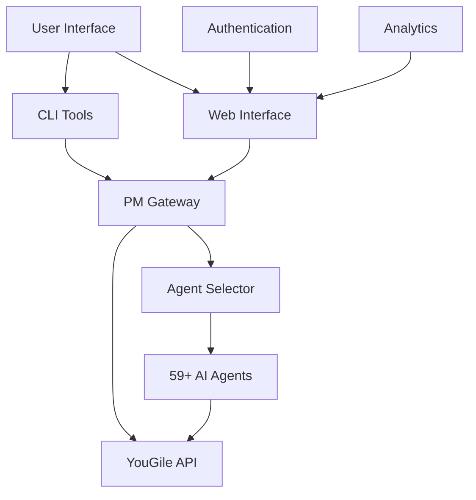

# 📖 AI-CRM System User Manual

This comprehensive manual covers all features and capabilities of the AI-CRM system. Whether you're a developer, project manager, or business user, this guide will help you master the platform.

## 📋 Table of Contents

1. [System Overview](#-system-overview)
2. [Command Line Interface](#-command-line-interface)
3. [Web Interface](#-web-interface)
4. [AI Agent System](#-ai-agent-system)
5. [Project Management Features](#-project-management-features)
6. [Authentication & User Management](#-authentication--user-management)
7. [Subscription Tiers](#-subscription-tiers)
8. [Integration & API](#-integration--api)
9. [Troubleshooting](#-troubleshooting)
10. [Best Practices](#-best-practices)

## 🎯 System Overview

### Architecture Components

The AI-CRM system consists of several integrated components:



**Core Components:**
- **CLI Tools** - Command-line interface for power users
- **Web Interface** - Modern React-based UI for visual task management
- **PM Gateway** - Intelligent project management with task analysis
- **Agent Selector** - AI system that matches tasks to specialist agents
- **AI Agents** - 59+ specialized experts for different domains
- **YouGile Integration** - Backend task management and storage
- **Authentication System** - User accounts and subscription management

### Key Capabilities

✅ **Intelligent Task Assignment** - AI analyzes tasks and recommends specialists  
✅ **Multi-Modal Access** - CLI, Web UI, and REST API access  
✅ **Project Management** - Complex task decomposition and workflow planning  
✅ **Real-Time Collaboration** - Live updates and team coordination  
✅ **Enterprise Security** - JWT authentication with role-based access control  
✅ **Subscription Management** - Free, Pro, and Enterprise tiers  
✅ **Analytics & Reporting** - Usage metrics and performance insights  

## 💻 Command Line Interface

### Installation & Setup

1. **Install Dependencies:**
   ```bash
   cd our-crm-ai
   pip install -r requirements.txt
   ```

2. **Set API Key:**
   ```bash
   export YOUGILE_API_KEY="your_api_key_here"
   ```

3. **Initialize System:**
   ```bash
   python3 crm_setup_enhanced.py
   ```

### Core CLI Commands

#### Task Creation
```bash
# Basic task creation with AI suggestion
python3 crm_enhanced.py create --title "Task Title" --description "Detailed description"

# Force specific agent assignment
python3 crm_enhanced.py create --title "Database backup" --owner database-admin

# Skip AI analysis for simple tasks
python3 crm_enhanced.py create --title "Update README" --no-ai-suggest
```

**Parameters:**
- `--title` (required) - Task title (keep concise but descriptive)
- `--description` (optional) - Detailed task description for better AI analysis
- `--owner` (optional) - Force assignment to specific agent
- `--no-ai-suggest` - Skip AI analysis and manual assignment

**Examples:**
```bash
# Development task
python3 crm_enhanced.py create --title "Fix authentication bug" --description "Users getting 401 errors on valid tokens"

# Infrastructure task
python3 crm_enhanced.py create --title "Setup monitoring" --description "Implement Prometheus and Grafana for system monitoring"

# Business task
python3 crm_enhanced.py create --title "Analyze user metrics" --description "Monthly engagement report with conversion funnel analysis"
```

#### PM Gateway Analysis
```bash
# Comprehensive project analysis
python3 crm_enhanced.py pm --title "Project Title" --description "Project details"

# Complex project decomposition
python3 crm_enhanced.py pm --title "Build recommendation engine" --description "ML-powered product suggestions with A/B testing framework"
```

**PM Gateway provides:**
- Task complexity assessment (SIMPLE, MODERATE, COMPLEX, EPIC)
- Estimated hours and priority levels
- Risk factor analysis
- Success criteria definition
- Workflow decomposition for complex tasks
- Dependency mapping between subtasks

#### Task Management
```bash
# List all tasks by status
python3 crm_enhanced.py list

# View specific task with details and comments
python3 crm_enhanced.py view <task_id>

# Update task ownership
python3 crm_enhanced.py update <task_id> --owner new-agent-name

# Move task between columns
python3 crm_enhanced.py move <task_id> --column "In Progress"
python3 crm_enhanced.py move <task_id> --column "Done"

# Add comments to tasks
python3 crm_enhanced.py comment <task_id> --message "Progress update or notes"

# Mark tasks complete/incomplete
python3 crm_enhanced.py complete <task_id>
python3 crm_enhanced.py uncomplete <task_id>
```

**Available Columns:**
- "To Do" - New and pending tasks
- "In Progress" - Active work items
- "Done" - Completed tasks
- Custom columns (configured during setup)

#### Agent Management
```bash
# List all available AI agents
python3 crm_enhanced.py agents

# Get agent suggestions without creating task
python3 crm_enhanced.py suggest "task description here"
```

**Agent Information Display:**
- Agent specializations and keywords
- Model assignments (Haiku/Sonnet/Opus)
- Available tools and capabilities
- Success rate and usage statistics

#### Advanced Commands
```bash
# Standalone PM Gateway access
python3 pm_agent_gateway.py analyze --title "Project" --description "Details"

# Backlog analysis and prioritization
python3 backlog_analyzer.py

# System health check
python3 crm_enhanced.py list  # Tests API connectivity

# Configuration validation
cat config.json  # View current configuration
```

### CLI Output Examples

#### Task Creation with AI Suggestion:
```
🎯 Creating task: 'Optimize database queries'
🤖 AI Analysis:
   Keywords detected: database, queries, performance, optimization
   Recommended agent: database-optimizer (confidence: 95%)
   Complexity: MODERATE
   Priority: HIGH
   Estimated time: 8 hours

✅ Task created successfully!
   ID: TASK-123
   Title: Optimize database queries
   Owner: database-optimizer
   Status: To Do
   URL: https://yougile.com/board/task/TASK-123
```

#### PM Gateway Analysis:
```
🎯 PM Agent analyzing task: 'Build e-commerce platform'
📊 Analysis Results:
   Complexity: EPIC
   Estimated: 120 hours
   Priority: MEDIUM
   Required agents: 7 specialists

🔄 Complex task detected - recommending decomposition
📋 Suggested subtasks (7):
   1. Requirements Analysis → business-analyst (16.0 hours)
   2. Database Schema Design → database-optimizer (12.0 hours)
   3. API Development → backend-architect (24.0 hours)
   4. Frontend Implementation → frontend-developer (32.0 hours)
   5. Payment Integration → payment-integration (16.0 hours)
   6. Security Implementation → security-auditor (12.0 hours)
   7. Deployment & Testing → devops-troubleshooter (8.0 hours)

💡 Recommendation: Break this task into subtasks for better management
```

## 🌐 Web Interface

### Accessing the Web UI

1. **Development Mode:**
   ```bash
   cd web-ui
   ./start-dev.sh
   # Frontend: http://localhost:3000
   # Backend API: http://localhost:8000
   ```

2. **Production Mode:**
   ```bash
   docker-compose --profile production up -d
   # Access: http://localhost (with SSL)
   ```

### Dashboard Overview

#### Main Navigation
- **Dashboard** - Kanban board with task management
- **Analytics** - Usage metrics and performance insights (Pro+)
- **Profile** - User account and session management
- **Admin** - User management (Admin role only)

#### Kanban Board Features
- **Drag & Drop** - Move tasks between "To Do", "In Progress", "Done"
- **Task Cards** - Show title, agent, priority, and estimated time
- **Quick Actions** - Edit, comment, assign, and delete from card context menu
- **Real-Time Updates** - Live synchronization across all connected users
- **Filtering** - Filter by agent, priority, or custom criteria
- **Search** - Find tasks by title, description, or agent

### Task Management Interface

#### Creating New Tasks
1. Click **"New Task"** button
2. Enter task title (required)
3. Add detailed description (optional but recommended)
4. Choose **"PM Analysis"** for complex tasks
5. Review AI agent suggestions with confidence scores
6. Override with manual agent selection if needed
7. Set priority level (Auto, Low, Medium, High, Urgent)
8. Submit to create task

#### Task Detail Modal
- **Overview Tab** - Title, description, agent, status, timestamps
- **Comments Tab** - Team collaboration and progress updates
- **History Tab** - Full audit trail of changes and assignments
- **Files Tab** - Attach documents and screenshots (Pro+)

#### Bulk Operations
- Select multiple tasks with checkboxes
- Bulk move between columns
- Bulk assign to agents
- Bulk priority changes
- Export selected tasks

### User Account Management

#### Profile Settings
- **Personal Information** - Name, email, profile picture
- **Preferences** - Time zone, notifications, dashboard layout
- **API Access** - Generate and manage API keys (Pro+)
- **Integrations** - Connect external tools (Enterprise)

#### Session Management
- **Active Sessions** - View all login sessions across devices
- **Session Details** - IP address, browser, last activity
- **Revoke Sessions** - Log out from specific devices or all sessions
- **Security Alerts** - Notifications for suspicious login attempts

#### Subscription Management
- **Current Plan** - View tier, features, and usage limits
- **Usage Metrics** - Monthly task creation and agent usage
- **Billing History** - Payment history and invoices (Pro+)
- **Upgrade Options** - Compare and change subscription tiers

### Mobile Responsiveness

The web interface is fully responsive and optimized for mobile devices:

- **Touch Interactions** - Drag & drop works on mobile
- **Mobile Navigation** - Collapsible sidebar and bottom navigation
- **Responsive Cards** - Task cards adapt to screen size
- **Touch-Friendly** - Larger touch targets and swipe gestures
- **Offline Support** - Basic offline functionality with sync

## 🤖 AI Agent System

### Agent Categories & Specializations

#### Development & Architecture (18 Agents)
| Agent | Specialization | Model | Key Use Cases |
|-------|---------------|-------|---------------|
| `python-pro` | Python development | Sonnet | Backend development, data processing, automation |
| `javascript-pro` | JavaScript/Node.js | Sonnet | Frontend development, API development |
| `typescript-pro` | TypeScript | Sonnet | Type-safe development, large applications |
| `frontend-developer` | React/UI development | Sonnet | User interfaces, responsive design |
| `backend-architect` | API/system design | Sonnet | Microservices, database design, architecture |
| `mobile-developer` | Mobile applications | Sonnet | React Native, Flutter, cross-platform |
| `golang-pro` | Go development | Sonnet | Microservices, system programming |
| `rust-pro` | Rust development | Sonnet | Systems programming, performance-critical code |
| `java-pro` | Java development | Sonnet | Enterprise applications, Spring Boot |
| `csharp-pro` | C# development | Sonnet | .NET applications, enterprise software |
| `php-pro` | PHP development | Sonnet | Web applications, Laravel, WordPress |
| `c-pro` | C development | Sonnet | Embedded systems, low-level programming |
| `cpp-pro` | C++ development | Sonnet | High-performance applications, game development |
| `scala-pro` | Scala development | Sonnet | Big data, Apache Spark, functional programming |
| `elixir-pro` | Elixir development | Sonnet | Concurrent systems, Phoenix framework |
| `ios-developer` | iOS development | Sonnet | Native iOS apps, Swift, SwiftUI |
| `unity-developer` | Unity game development | Sonnet | Game development, 3D applications |
| `minecraft-bukkit-pro` | Minecraft plugins | Sonnet | Server plugins, Bukkit/Spigot development |

#### Infrastructure & Operations (8 Agents)
| Agent | Specialization | Model | Key Use Cases |
|-------|---------------|-------|---------------|
| `devops-troubleshooter` | Production issues | Sonnet | Debugging, deployment failures, monitoring |
| `cloud-architect` | Cloud infrastructure | Opus | AWS/Azure/GCP design, scalability |
| `deployment-engineer` | CI/CD pipelines | Sonnet | Docker, Kubernetes, automation |
| `network-engineer` | Network configuration | Sonnet | DNS, SSL, load balancers, connectivity |
| `database-admin` | Database operations | Sonnet | Backups, replication, user management |
| `database-optimizer` | Query performance | Sonnet | Indexing, query optimization, performance |
| `terraform-specialist` | Infrastructure as Code | Sonnet | Terraform modules, state management |
| `incident-responder` | Critical incidents | Opus | Production outages, emergency response |

#### Quality & Security (6 Agents)
| Agent | Specialization | Model | Key Use Cases |
|-------|---------------|-------|---------------|
| `security-auditor` | Security analysis | Opus | Vulnerability assessment, compliance |
| `code-reviewer` | Code quality | Sonnet | Code review, best practices, standards |
| `test-automator` | Testing frameworks | Sonnet | Unit tests, integration tests, CI/CD |
| `performance-engineer` | Application optimization | Opus | Profiling, bottleneck analysis, tuning |
| `debugger` | Bug investigation | Sonnet | Error analysis, root cause investigation |
| `error-detective` | Log analysis | Sonnet | Error patterns, system troubleshooting |

#### Data & AI (5 Agents)
| Agent | Specialization | Model | Key Use Cases |
|-------|---------------|-------|---------------|
| `data-scientist` | Data analysis | Haiku | SQL queries, insights, reporting |
| `data-engineer` | Data pipelines | Sonnet | ETL, data warehousing, streaming |
| `ml-engineer` | ML deployment | Sonnet | Model serving, MLOps, production ML |
| `mlops-engineer` | ML infrastructure | Opus | Experiment tracking, model registries |
| `ai-engineer` | AI applications | Opus | LLM applications, RAG systems, chatbots |

#### Documentation & Communication (5 Agents)
| Agent | Specialization | Model | Key Use Cases |
|-------|---------------|-------|---------------|
| `docs-architect` | Technical documentation | Opus | System documentation, architecture guides |
| `api-documenter` | API documentation | Haiku | OpenAPI specs, SDK documentation |
| `tutorial-engineer` | Educational content | Opus | Step-by-step tutorials, onboarding |
| `reference-builder` | Reference materials | Haiku | API references, configuration guides |
| `mermaid-expert` | Diagrams & visualization | Sonnet | Flowcharts, system diagrams, ERDs |

#### Business & Strategy (8 Agents)
| Agent | Specialization | Model | Key Use Cases |
|-------|---------------|-------|---------------|
| `business-analyst` | Business metrics | Haiku | KPIs, reporting, business intelligence |
| `content-marketer` | Content creation | Haiku | Blog posts, social media, SEO content |
| `sales-automator` | Sales processes | Haiku | Cold emails, lead nurturing, proposals |
| `customer-support` | User support | Haiku | FAQ, support tickets, help documentation |
| `legal-advisor` | Legal documentation | Haiku | Privacy policies, terms of service |
| `quant-analyst` | Financial modeling | Opus | Trading strategies, risk analysis |
| `risk-manager` | Risk assessment | Opus | Portfolio risk, hedging strategies |
| `search-specialist` | Research & analysis | Haiku | Market research, competitive analysis |

#### Specialized Domains (9 Agents)
| Agent | Specialization | Model | Key Use Cases |
|-------|---------------|-------|---------------|
| `payment-integration` | Payment processing | Sonnet | Stripe, PayPal, billing systems |
| `legacy-modernizer` | Code modernization | Sonnet | Framework migrations, technical debt |
| `sql-pro` | Database development | Sonnet | Complex queries, schema design |
| `graphql-architect` | GraphQL systems | Sonnet | Schema design, resolvers, federation |
| `dx-optimizer` | Developer experience | Sonnet | Tooling, workflows, team efficiency |
| `architect-reviewer` | Architecture review | Opus | System design review, patterns |
| `context-manager` | Multi-agent coordination | Opus | Complex workflow orchestration |
| `prompt-engineer` | AI prompt optimization | Opus | LLM prompts, AI system design |
| `general-purpose` | General tasks | Sonnet | Research, analysis, multi-step tasks |

### Agent Selection Algorithm

#### Automatic Selection Process
1. **Text Analysis** - Extracts keywords from title and description
2. **Domain Mapping** - Maps keywords to agent specializations
3. **Confidence Scoring** - Calculates match confidence (0-100%)
4. **Complexity Assessment** - Determines if multiple agents are needed
5. **Final Selection** - Chooses highest-confidence match

#### Selection Criteria
```python
# Example keyword mappings
specializations = {
    'frontend-developer': ['ui', 'ux', 'react', 'vue', 'angular', 'css', 'html', 'javascript'],
    'backend-architect': ['api', 'microservices', 'database', 'server', 'architecture'],
    'security-auditor': ['security', 'vulnerability', 'authentication', 'authorization'],
    'database-optimizer': ['database', 'sql', 'query', 'performance', 'optimization'],
    'devops-troubleshooter': ['deployment', 'docker', 'kubernetes', 'ci/cd', 'production']
}
```

#### Multi-Agent Scenarios
Complex tasks may require multiple agents in sequence:
- **Primary Agent** - Main specialist for the task
- **Review Agents** - Quality assurance and validation
- **Support Agents** - Complementary expertise

Example: "Implement secure payment processing"
1. `payment-integration` - Primary implementation
2. `security-auditor` - Security review
3. `test-automator` - Testing and validation

### Agent Performance Metrics

#### Success Indicators
- **Task Completion Rate** - Percentage of successfully completed assignments
- **Time Accuracy** - How closely estimated time matches actual time
- **Quality Score** - Based on review feedback and rework requirements
- **Specialization Fit** - How well agent skills match task requirements

#### Usage Analytics
- **Assignment Frequency** - How often each agent is selected
- **Domain Coverage** - Which task types each agent handles
- **Collaboration Patterns** - Which agents work well together
- **User Satisfaction** - Feedback and rating scores

## 📊 Project Management Features

### PM Gateway Capabilities

#### Task Analysis Engine
The PM Gateway provides comprehensive analysis for every task:

**Complexity Assessment:**
- **SIMPLE (2-4 hours)** - Straightforward tasks, single agent, minimal dependencies
- **MODERATE (8-16 hours)** - Standard complexity, 1-2 agents, some coordination
- **COMPLEX (32-60 hours)** - Multi-stage tasks, 2-4 agents, significant dependencies
- **EPIC (80+ hours)** - Major projects, 4+ agents, complex workflows

**Priority Classification:**
- **URGENT** - Critical issues requiring immediate attention
- **HIGH** - Important tasks with significant business impact
- **MEDIUM** - Standard priority for regular work items
- **LOW** - Nice-to-have improvements and optimizations

#### Workflow Decomposition

For complex tasks, the PM Gateway automatically creates detailed workflows:

```
🎯 PM Analysis: Build Recommendation Engine
📊 Complexity: COMPLEX (48 hours)
📋 Workflow Breakdown:

Phase 1: Data Foundation (16 hours)
├── Data Collection → data-engineer (8h)
├── Data Analysis → data-scientist (4h)
└── Schema Design → database-optimizer (4h)

Phase 2: ML Development (20 hours)
├── Model Development → ml-engineer (12h)
├── Training Pipeline → mlops-engineer (4h)
└── Model Validation → data-scientist (4h)

Phase 3: Integration (12 hours)
├── API Development → backend-architect (6h)
├── Frontend Integration → frontend-developer (4h)
└── Testing → test-automator (2h)

🔗 Dependencies:
Phase 2 depends on Phase 1 completion
Phase 3 depends on Phase 2 completion
```

### Strategic Planning Features

#### Backlog Analysis
```bash
python3 backlog_analyzer.py
```

Provides insights on:
- Task distribution across agents and domains
- Priority balance and urgent task identification
- Resource allocation recommendations
- Bottleneck identification in workflow
- Completion time projections

#### Risk Assessment

For each task, the PM Gateway identifies potential risks:
- **Technical Risks** - Complexity, dependencies, integration challenges
- **Resource Risks** - Availability, expertise gaps, workload distribution
- **Timeline Risks** - Scope creep, estimation accuracy, external dependencies
- **Quality Risks** - Testing coverage, security considerations, performance impact

#### Success Criteria Definition

Automatically generates success criteria based on task type:
- **Development Tasks** - Code quality, test coverage, performance benchmarks
- **Infrastructure Tasks** - Deployment success, monitoring, security compliance
- **Documentation Tasks** - Completeness, accuracy, accessibility
- **Business Tasks** - Metric improvements, user satisfaction, ROI achievement

### Project Templates

#### Full-Stack Feature Development
```
1. Requirements Analysis → business-analyst
2. Architecture Design → backend-architect
3. Database Schema → database-optimizer
4. API Development → backend-architect
5. Frontend Implementation → frontend-developer
6. Testing Suite → test-automator
7. Security Review → security-auditor
8. Documentation → docs-architect
9. Deployment → deployment-engineer
```

#### Infrastructure Project
```
1. Requirements Gathering → cloud-architect
2. Infrastructure Design → cloud-architect
3. Terraform Code → terraform-specialist
4. Deployment Pipeline → deployment-engineer
5. Monitoring Setup → devops-troubleshooter
6. Security Hardening → security-auditor
7. Documentation → docs-architect
```

#### Data Analysis Project
```
1. Data Discovery → data-engineer
2. Data Collection → data-engineer
3. Analysis & Insights → data-scientist
4. Visualization → business-analyst
5. Report Generation → docs-architect
6. Presentation → business-analyst
```

## 🔐 Authentication & User Management

### User Account System

#### Registration & Login
- **Email-based registration** with verification
- **Strong password requirements** with complexity validation
- **JWT token authentication** with automatic refresh
- **Multi-device session management**
- **Password reset and recovery**

#### User Roles
- **User** - Standard access to create and manage own tasks
- **Manager** - Team oversight, can view and assign team tasks
- **Admin** - Full system access, user management, system configuration

#### Security Features
- **Session tracking** with device fingerprinting
- **Audit logging** for all security events
- **Rate limiting** based on subscription tier
- **Security headers** and CSRF protection
- **Password strength validation**

### Profile Management

#### Personal Settings
- **Profile Information** - Name, email, avatar, bio
- **Preferences** - Theme, notifications, language, timezone
- **Privacy Settings** - Profile visibility, data sharing preferences
- **Communication Preferences** - Email notifications, alerts, summaries

#### Session Management
View and manage all active sessions:
- **Current Sessions** - All logged-in devices and browsers
- **Session Details** - IP address, location, browser, last activity
- **Remote Logout** - Revoke access from specific devices
- **Security Alerts** - Notifications for suspicious login attempts

### API Access Management

#### API Key Generation (Pro+)
- **Personal API Keys** - For individual automation and integrations
- **Application Keys** - For team and organizational use
- **Scoped Access** - Limit API key permissions and capabilities
- **Usage Monitoring** - Track API key usage and rate limits

#### Webhook Configuration (Enterprise)
- **Event Subscriptions** - Get notified of task updates and changes
- **Custom Endpoints** - Configure webhook destinations
- **Retry Logic** - Automatic retry for failed webhook deliveries
- **Security Validation** - HMAC signature verification

## 💰 Subscription Tiers

### Free Tier ($0/month)
**Features:**
- ✅ 9 Haiku AI agents (fast, cost-effective)
- ✅ Basic task management (10 tasks/month)
- ✅ Web interface access
- ✅ Community support

**AI Agents Included:**
- `data-scientist` - SQL queries and data analysis
- `api-documenter` - OpenAPI documentation
- `reference-builder` - Technical references
- `business-analyst` - Basic metrics and KPIs
- `content-marketer` - Blog posts and social media
- `customer-support` - Support tickets and FAQs
- `sales-automator` - Basic sales automation
- `search-specialist` - Web research
- `legal-advisor` - Legal document templates

**Limitations:**
- 10 tasks per month
- Basic PM Gateway (simple analysis only)
- Community support only
- No API access
- No analytics dashboard
- Standard rate limits (10 req/min)

### Pro Tier ($49/month)
**Features:**
- ✅ 37 Sonnet AI agents (balanced performance)
- ✅ Unlimited task creation
- ✅ Full PM Gateway with complex analysis
- ✅ Analytics dashboard
- ✅ API access with personal keys
- ✅ Priority email support
- ✅ Advanced integrations

**Additional AI Agents:**
- All Free tier agents plus 28 more including:
- Development specialists (Python, JavaScript, TypeScript, etc.)
- Infrastructure experts (DevOps, Cloud, Database)
- Quality assurance (Code review, Testing, Debugging)
- Documentation specialists (Technical writing, Tutorials)

**Enhanced Features:**
- Complex task decomposition
- Multi-agent workflows
- Usage analytics and reporting
- Personal API keys (1000 calls/day)
- Webhook notifications
- Priority support (24-hour response)
- Advanced rate limits (60 req/min)

### Enterprise Tier (Custom pricing)
**Features:**
- ✅ All 59+ AI agents including Opus (maximum capability)
- ✅ Custom agent development
- ✅ SSO integration (SAML, OAuth)
- ✅ Advanced analytics and reporting
- ✅ Dedicated customer success manager
- ✅ SLA guarantees (99.9% uptime)
- ✅ Custom deployment options

**Exclusive AI Agents:**
- All Pro tier agents plus premium agents:
- `ai-engineer` - LLM applications and RAG systems
- `security-auditor` - Comprehensive security analysis
- `performance-engineer` - Advanced optimization
- `incident-responder` - Critical incident management
- `mlops-engineer` - ML infrastructure and pipelines
- `architect-reviewer` - System architecture review
- `cloud-architect` - Enterprise cloud design
- `context-manager` - Multi-agent orchestration
- `quant-analyst` - Financial modeling
- `risk-manager` - Portfolio risk management
- `docs-architect` - Comprehensive documentation
- `tutorial-engineer` - Educational content

**Enterprise Features:**
- Custom agent training and specialization
- Multi-tenant architecture
- Advanced security and compliance
- Custom integrations and APIs
- Dedicated infrastructure
- 24/7 phone and chat support
- Custom rate limits (200+ req/min)
- Professional services included

### Subscription Management

#### Upgrading/Downgrading
- **Instant Upgrades** - Access new features immediately
- **Graceful Downgrades** - Existing data preserved, features limited
- **Prorated Billing** - Fair billing adjustments for tier changes
- **Migration Assistance** - Help transitioning between tiers

#### Usage Monitoring
- **Real-time Usage** - Track current month's task and API usage
- **Usage Alerts** - Notifications when approaching limits
- **Historical Reports** - Monthly usage trends and patterns
- **Optimization Recommendations** - Suggestions for optimal tier selection

## 🔌 Integration & API

### REST API Access

#### Authentication
```bash
# Using API key (Pro+)
curl -H "Authorization: Bearer YOUR_API_KEY" \
  https://api.yourcrm.com/tasks

# Using JWT token
curl -H "Authorization: Bearer YOUR_JWT_TOKEN" \
  https://api.yourcrm.com/tasks
```

#### Core Endpoints

**Tasks Management:**
```bash
# List tasks
GET /api/v1/tasks
GET /api/v1/tasks?status=in_progress&agent=python-pro

# Create task
POST /api/v1/tasks
{
  "title": "Task title",
  "description": "Task description",
  "owner": "agent-name"  # optional
}

# Get task details
GET /api/v1/tasks/{task_id}

# Update task
PUT /api/v1/tasks/{task_id}
{
  "status": "done",
  "owner": "new-agent"
}

# Delete task
DELETE /api/v1/tasks/{task_id}
```

**AI Agent Integration:**
```bash
# Get agent suggestions
POST /api/v1/agents/suggest
{
  "description": "task description for analysis"
}

# List available agents
GET /api/v1/agents
GET /api/v1/agents?tier=pro&category=development

# PM Gateway analysis
POST /api/v1/pm/analyze
{
  "title": "Project title",
  "description": "Project details"
}
```

**Analytics & Reporting (Pro+):**
```bash
# Usage statistics
GET /api/v1/analytics/usage?period=month

# Task completion metrics
GET /api/v1/analytics/tasks?groupBy=agent

# Performance insights
GET /api/v1/analytics/performance
```

### Webhook Integration (Pro+)

#### Event Types
- `task.created` - New task created
- `task.updated` - Task status or assignment changed
- `task.completed` - Task marked as done
- `task.commented` - New comment added
- `user.registered` - New user account created
- `subscription.changed` - Subscription tier modified

#### Webhook Configuration
```bash
# Register webhook endpoint
POST /api/v1/webhooks
{
  "url": "https://your-app.com/webhook",
  "events": ["task.created", "task.updated"],
  "secret": "your-webhook-secret"
}

# List webhooks
GET /api/v1/webhooks

# Test webhook
POST /api/v1/webhooks/{webhook_id}/test
```

#### Webhook Payload Example
```json
{
  "event": "task.created",
  "timestamp": "2024-01-15T10:30:00Z",
  "data": {
    "task_id": "TASK-123",
    "title": "Fix authentication bug",
    "owner": "security-auditor",
    "status": "to_do",
    "created_by": "user@example.com"
  },
  "signature": "sha256=..."
}
```

### Third-Party Integrations

#### Slack Integration
```bash
# Install Slack app to workspace
# Configure webhook to post task updates

# Example: Task completion notification
POST https://hooks.slack.com/your-webhook
{
  "text": "✅ Task completed: Fix authentication bug (security-auditor)"
}
```

#### Jira Integration (Enterprise)
```bash
# Sync tasks between AI-CRM and Jira
# Bidirectional updates for status changes
# Import existing Jira projects

# Configuration
POST /api/v1/integrations/jira
{
  "base_url": "https://yourcompany.atlassian.net",
  "username": "integration@yourcompany.com",
  "api_token": "your-jira-token",
  "project_key": "PROJ"
}
```

#### GitHub Integration (Pro+)
```bash
# Link tasks to GitHub issues and PRs
# Automatic task updates on PR merge
# Code review task creation

# Link task to GitHub issue
PUT /api/v1/tasks/{task_id}/links
{
  "type": "github_issue",
  "url": "https://github.com/org/repo/issues/123"
}
```

### SDK and Libraries

#### Python SDK
```python
# Install: pip install ai-crm-sdk
from ai_crm import Client

client = Client(api_key="your_api_key")

# Create task with AI suggestion
task = client.tasks.create(
    title="Optimize database queries",
    description="Slow SELECT queries affecting user experience"
)
print(f"Task assigned to: {task.owner}")

# Get PM analysis
analysis = client.pm.analyze(
    title="Build recommendation engine",
    description="ML-powered product suggestions"
)
print(f"Complexity: {analysis.complexity}")
print(f"Estimated hours: {analysis.estimated_hours}")
```

#### JavaScript/Node.js SDK
```javascript
// Install: npm install ai-crm-sdk
const { AIClient } = require('ai-crm-sdk');

const client = new AIClient({ apiKey: 'your_api_key' });

// Create and analyze task
const task = await client.tasks.create({
  title: 'Implement real-time notifications',
  description: 'WebSocket-based live updates for task changes'
});

console.log(`AI suggested agent: ${task.owner}`);

// Get agent suggestions
const suggestions = await client.agents.suggest(
  'implement JWT authentication with refresh tokens'
);
console.log(suggestions);
```

## 🚨 Troubleshooting

### Common Issues & Solutions

#### CLI Issues

**Problem: "Command not found" or "No module named"**
```bash
# Solution: Ensure proper setup
cd our-crm-ai
pip install -r requirements.txt
python3 crm_enhanced.py --help  # Test installation
```

**Problem: "YOUGILE_API_KEY not set"**
```bash
# Solution: Set environment variable
export YOUGILE_API_KEY="your_actual_api_key"
echo $YOUGILE_API_KEY  # Verify it's set

# Or add to your shell profile
echo 'export YOUGILE_API_KEY="your_key"' >> ~/.bashrc
source ~/.bashrc
```

**Problem: "Failed to load CRM configuration"**
```bash
# Solution: Run setup script
python3 crm_setup_enhanced.py

# Or check if config.json exists
ls -la config.json
cat config.json  # Verify contents
```

**Problem: "Invalid agent name"**
```bash
# Solution: List available agents
python3 crm_enhanced.py agents

# Check spelling and use exact agent names
python3 crm_enhanced.py create --title "Test" --owner "python-pro"  # Correct
python3 crm_enhanced.py create --title "Test" --owner "python_pro"   # Incorrect
```

#### Web Interface Issues

**Problem: Web UI not loading**
```bash
# Check if containers are running
docker-compose ps

# Restart services
docker-compose down
docker-compose up --build

# Check logs for errors
docker-compose logs frontend
docker-compose logs backend
```

**Problem: "API connection failed"**
```bash
# Check backend health
curl http://localhost:8000/health

# Verify environment variables
docker-compose exec backend env | grep YOUGILE

# Check API key format
# Should be: YOUGILE_API_KEY=abcd1234-ef56-7890...
```

**Problem: Login/Registration not working**
```bash
# Check database initialization
docker-compose exec backend python init_db.py

# Reset database if needed
docker-compose down -v  # Removes volumes
docker-compose up --build
```

**Problem: Tasks not syncing between CLI and Web**
```bash
# Both use same YouGile backend - check config
python3 crm_enhanced.py list  # CLI tasks
curl http://localhost:8000/api/v1/tasks  # Web API tasks

# Should show same data
```

#### API Issues

**Problem: API rate limiting**
```bash
# Check your subscription tier limits
# Free: 10 req/min, Pro: 60 req/min, Enterprise: 200+ req/min

# Add delays between requests
sleep 1  # Wait 1 second between API calls

# Use bulk operations when available
```

**Problem: Authentication failures**
```bash
# Verify API key format
curl -H "Authorization: Bearer YOUR_KEY" \
  http://localhost:8000/api/v1/tasks

# Check JWT token expiration
# Tokens expire after 30 minutes - refresh automatically
```

#### Agent Selection Issues

**Problem: AI suggesting wrong agents**
```bash
# Be more specific in task descriptions
# Instead of: "Fix bug"
# Use: "Fix authentication bug - users getting 401 errors on valid JWT tokens"

# Override AI suggestion if needed
python3 crm_enhanced.py create --title "Task" --owner "specific-agent"
```

**Problem: PM Gateway not working**
```bash
# Check if file exists
ls -la pm_agent_gateway.py

# Test standalone
python3 pm_agent_gateway.py analyze --title "Test task"

# Check for import errors
python3 -c "import pm_agent_gateway"
```

### Performance Issues

#### CLI Performance
```bash
# Speed up CLI operations
export PYTHONPATH=.  # Avoid import delays
python3 -O crm_enhanced.py  # Run in optimized mode

# Cache agent data
python3 crm_enhanced.py agents > /tmp/agents.cache
```

#### Web UI Performance
```bash
# Enable production optimizations
NODE_ENV=production npm run build  # Frontend
docker-compose --profile production up  # Backend

# Enable caching
# Redis for session storage
# CDN for static assets
```

### Data Issues

#### Task Synchronization
```bash
# Force sync with YouGile
python3 crm_enhanced.py list --refresh

# Check YouGile API directly
curl -H "Authorization: Bearer $YOUGILE_API_KEY" \
  https://yougile.com/api-v2/projects/PROJECT_ID/tasks
```

#### Data Backup
```bash
# Export task data
python3 crm_enhanced.py export --format json > backup.json

# Import data
python3 crm_enhanced.py import backup.json
```

### Getting Additional Help

#### Log Files
```bash
# CLI logs
tail -f ai-crm.log

# Web UI logs  
docker-compose logs --follow frontend
docker-compose logs --follow backend

# System logs
journalctl -u docker  # Docker service logs
```

#### Diagnostic Commands
```bash
# System health check
python3 crm_enhanced.py diagnose

# API connectivity test
curl -v http://localhost:8000/health

# Database connection test
docker-compose exec backend python -c "from database import engine; print(engine.connect())"
```

#### Support Channels
- **Free Tier**: Community forums and documentation
- **Pro Tier**: Email support (24-hour response SLA)
- **Enterprise Tier**: Phone support, dedicated success manager

## 💡 Best Practices

### Task Creation Best Practices

#### Writing Effective Task Titles
```bash
# Good examples (specific and actionable)
✅ "Fix login redirect bug after OAuth authentication"
✅ "Optimize PostgreSQL query performance in user dashboard"
✅ "Implement Redis caching for API responses"
✅ "Create user onboarding tutorial documentation"

# Poor examples (vague and unclear)
❌ "Fix bug"
❌ "Improve performance"
❌ "Add feature"
❌ "Update docs"
```

#### Providing Detailed Descriptions
Include relevant context for better AI analysis:
- **Current behavior** vs **expected behavior**
- **Technical constraints** and requirements
- **Business impact** and urgency
- **Dependencies** on other systems or tasks
- **Success criteria** and acceptance requirements

Example:
```bash
python3 crm_enhanced.py create \
  --title "Implement JWT refresh token mechanism" \
  --description "
Current: JWT tokens expire after 30 minutes, users get logged out
Expected: Automatic token refresh without user interruption
Technical: Use httpOnly cookies for refresh tokens, implement rotation
Business: Improving user experience, reducing support tickets
Dependencies: Requires Redis for token blacklist
Success: Users stay logged in for 7 days without interruption"
```

### Agent Selection Strategy

#### When to Let AI Choose
- **Complex or unfamiliar tasks** - AI has broader knowledge of specializations
- **Multi-disciplinary tasks** - AI can identify primary and secondary specialists
- **Cross-functional projects** - AI understands agent collaboration patterns
- **New team members** - AI provides learning opportunities about agent capabilities

#### When to Override AI Selection
- **Team-specific knowledge** - Local conventions or specific requirements
- **Workload balancing** - Distribute work across different specialists
- **Learning opportunities** - Assign tasks to develop specific skills
- **Emergency situations** - Need immediate response from available agents

#### Using PM Gateway Effectively

For complex projects, always use PM Gateway analysis:
```bash
# Before breaking down manually
python3 crm_enhanced.py pm --title "Migrate to microservices" --description "Detailed requirements..."

# Review the suggested workflow and dependencies
# Create subtasks based on recommendations
# Adjust timeline based on team capacity
```

### Workflow Organization

#### Task Hierarchy
```
Epic: Build E-commerce Platform
├── Feature: User Authentication
│   ├── Task: Design JWT system → security-auditor
│   ├── Task: Implement API endpoints → backend-architect
│   └── Task: Create login UI → frontend-developer
├── Feature: Product Catalog
│   ├── Task: Database schema → database-optimizer
│   ├── Task: Search functionality → backend-architect
│   └── Task: Product listing UI → frontend-developer
└── Feature: Payment Processing
    ├── Task: Stripe integration → payment-integration
    ├── Task: Webhook handling → backend-architect
    └── Task: Payment UI → frontend-developer
```

#### Status Management
- **To Do** - Newly created, not yet started
- **In Progress** - Actively being worked on
- **Blocked** - Waiting for dependencies or external input
- **Review** - Completed, awaiting review or testing
- **Done** - Fully completed and verified

#### Comment Best Practices
Use comments for:
- **Progress updates** - Regular status updates
- **Clarifications** - Additional requirements or constraints  
- **Blockers** - Issues preventing progress
- **Handoffs** - Information for next agent or team member
- **Decisions** - Record important choices and rationale

### Team Collaboration

#### Multi-Agent Workflows
When tasks require multiple agents:
1. **Primary Agent** - Handles main implementation
2. **Review Agents** - Provide quality assurance
3. **Support Agents** - Handle dependencies and integration

Example workflow:
```
Primary: backend-architect (API implementation)
→ Review: security-auditor (security validation)  
→ Review: performance-engineer (performance testing)
→ Support: test-automator (test suite creation)
→ Support: docs-architect (API documentation)
```

#### Communication Patterns
- **Handoff Comments** - Clear information transfer between agents
- **Decision Documentation** - Record choices and reasoning
- **Progress Updates** - Regular status communication
- **Issue Escalation** - Clear escalation path for blockers

### Performance Optimization

#### CLI Usage Optimization
```bash
# Cache agent list for faster lookups
python3 crm_enhanced.py agents > ~/.agents_cache

# Use batch operations
python3 crm_enhanced.py batch_create tasks.json

# Parallel task creation
for task in task_list; do
  python3 crm_enhanced.py create --title "$task" &
done
wait
```

#### Web UI Optimization  
- **Use keyboard shortcuts** for faster navigation
- **Leverage drag & drop** for quick status updates
- **Use filters** to focus on relevant tasks
- **Batch operations** for multiple task updates
- **Mobile responsiveness** for on-the-go access

#### API Usage Optimization
```bash
# Use bulk endpoints when available
POST /api/v1/tasks/bulk
[
  {"title": "Task 1", "description": "..."},
  {"title": "Task 2", "description": "..."}
]

# Implement pagination for large datasets
GET /api/v1/tasks?page=1&limit=50

# Use ETags for caching
GET /api/v1/tasks
If-None-Match: "etag-value"
```

### Security Best Practices

#### API Key Management
- **Environment Variables** - Never hardcode API keys
- **Key Rotation** - Regularly rotate API keys
- **Scope Limitation** - Use minimum required permissions
- **Monitoring** - Monitor API key usage for anomalies

#### Access Control
- **Role-Based Access** - Assign appropriate roles to users
- **Session Management** - Regular session cleanup
- **Audit Logging** - Monitor security events
- **Multi-Factor Authentication** - Enable 2FA when available

#### Data Protection
- **Input Validation** - Sanitize all user inputs
- **Output Encoding** - Prevent XSS in web interface
- **Encryption** - Use HTTPS for all communications
- **Backup Security** - Encrypt sensitive data backups

This comprehensive user manual provides detailed guidance for effectively using the AI-CRM system. Whether you're a new user getting started or an experienced user optimizing workflows, these practices will help you maximize the value of the 59+ AI specialists and advanced project management capabilities.